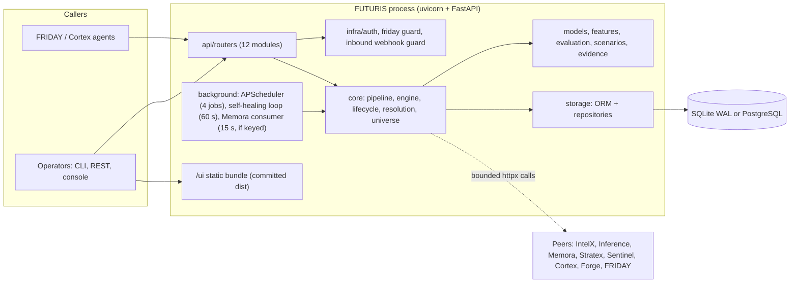
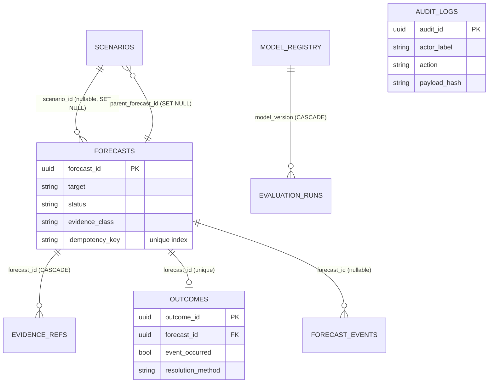
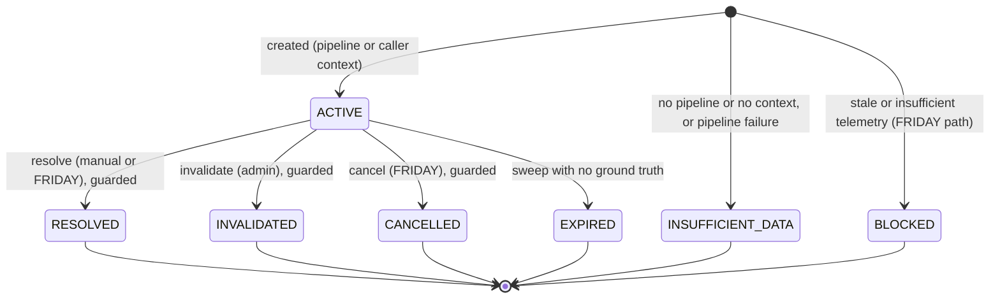

# Repository Comprehension Report — FUTURIS v2.0.0

| Field | Value |
|---|---|
| Repository | `surendra2304/Futuris` (local checkout `/home/user/Futuris`) |
| Base commit | `a9ddb90` (merge of PR #1, single squashed commit on `main`) |
| Session branch | `arena/9dca2f7e-futuris` (commits are local; nothing was pushed) |
| Run dates | 2026-10-07 to 2026-10-08 (sandbox clock) |
| Scope | Full repository: Python service, React console, Alembic migrations, CI, Docker/Render configs, scripts, docs |
| Methodology | 15 phases (P0 ground truth → P15 synthesis), executed where possible; live-fire hardening pass added after the comprehension pass |
| Certainty labels | **[FACT]** verified by execution or by reading the cited lines in this pass · **[INFERENCE]** reasoned from facts · **[HYPOTHESIS]** plausible, not tested |
| Citation format | `path:line` relative to the repository root |

---

## 0. Executive summary

**What it is.** FUTURIS is a single-process FastAPI service that produces calibrated, provenance-labelled forecasts. It runs a five-stage pipeline (ingest → normalise → contextualise → model → calibrate/decide) [FACT: `futuris/core/pipeline.py:364`], persists forecasts with an append-only event log, resolves outcomes, runs counterfactual scenarios, serves a FRIDAY-facing delegation surface, and ships a React console mounted at `/ui` [FACT: `futuris/api/app.py:295`].

**Verdict after execution.** The repository's central promise — never present an invented number as a measurement — is largely implemented and is enforced in code, schemas and tests [FACT: `futuris/core/schemas.py:205-259`, `futuris/core/universe_forecasting.py`]. Running the service the way it is meant to be used, and then pushing it hard, found real defects that passing unit tests had not. They are listed in §18 (B1–B23). The most serious were a connection-pool exhaustion that turned 50% of a 30-request burst into HTTP 500s, an idempotency race that created duplicate forecasts, a configuration path that made every request an administrator in production (B20), and a liveness endpoint that stalled behind a forecast. All of them are fixed in this tree and pinned by regression tests, with one qualification found in the rebuilt environment: the same-key regression test for B2 fails intermittently, because concurrent same-key requests can hit SQLite's write-lock failure (B36, §18.1).

**Headline numbers (measured in this pass).**

| Measure | Before live-fire pass | After | Evidence |
|---|---|---|---|
| Extreme-pressure checks passing | 6 / 12 (initial), 10 / 12 (mid), **12 / 12** (final) | **12 / 12** in the rebuilt environment (V46); 11 / 12 on the pre-reset run 2 (V37) | §16 V14, V37, V46 |
| 30-way concurrent FRIDAY delegations returning 500 | 15 of 30 | 0 of 30 | §16 V14, B1 |
| Forecasts created by an 8-way retry storm sharing one key | 8 distinct | 1 | §16 V14, B2 |
| Liveness probe maximum under a forecast burst | 8.1 s (failed 5 s threshold) | 3.9 s | §16 V13, B9 |
| Self-status latency behind one running forecast | 8–13 s | 0.01–3.8 s | §16 V13, B9 |
| Adversarial API cases with findings | — | 0 of 1390 (round 1, V15); 0 of 1390 in the rebuilt environment (V47) | §16 V15, V47 |
| E2E subsystem checks | 13 / 13 | 13 / 13 | §16 V11 |
| Mesh (peer fleet) scenarios | 9 / 10 (replay artefact) | 10 / 10 | §16 V12, B11 |
| Test suite | 313 (merge-commit claim) | **341 passed, 0 failed (exit 0)** | §16 V27 |
| Known vulnerabilities (pip-audit / npm audit prod) | clean / **2 moderate** | clean / **0** | §16 V6, V9 |
| **Round 2:** test suite (405 collected; xfail = known defect B24) | 341 passed | Pre-reset: **404 passed, 1 xfailed, 0 failed** (V40). Rebuilt environment: **402 passed, 2 failed, 1 xfailed**, exit 1 (V43): same-key test B36, 30 s peer bound B38 | §16 V40, V43, V44 |
| **Round 2:** line coverage of `futuris/` (CI gate 75 %) | 80 % (8,029 stmts) | **81.8 %** pre-reset (1,476 missed); **81.7 %** rebuilt environment (8,100 stmts, 1,479 missed) | §16 V40, V43 |
| **Round 2:** anonymous heavy reads under burst | unbudgeted | 6 × `503` (honest) then 6 × `429` with `Retry-After` | §16 V37 |
| **Round 2:** event-loop stall during a forecast fit (bound 3 s) | 3.9 s (round-1 maximum) | **4.0–6.7 s** measured (B24, open) | §16 V34 |
| **Round 2:** known vulnerabilities, UI full tree | 10 (none critical) | 13 (1 critical in vitest's UI server; dev-only) | §16 V36 |

**Round 2.** The environment was reset twice during this round. The first reset removed the round-1 commits from the object database. The second removed the round-2 commits that had been recreated after the first, and everything under `/tmp`. Both times the working tree was restored with its content; after the second reset the restored tree was checked against 59 content markers before any commit. The history was rebuilt as six commits plus the report commit (§14.1). The environment was rebuilt from `uv.lock`, and the headline numbers below were re-run in it (§16, V43–V55). Round 2 closes or narrows S04/S05 (per-client budget for anonymous reads with `429` and `Retry-After`; the matrix backfill is audited), S11 (docs off in production by default), S12 (baseline headers; CSP on the console only; HSTS in production only), S20 (self-heal and peer resets audited), M12 (alias mounts hidden from the schema), R9 (`uuid4` run identifiers), R12 (failed resolutions record a reason), D13 (every test runs against its own database), and the CI gaps (lock-based installs, coverage gate at 75 %, dependency audit, UI tests). It also measured a new high-severity defect that remains open: **B24**. A forecast fit holds the GIL inside statsforecast's compiled ETS optimiser, so the event loop stalls for 4–7 s on this 2-vCPU host (§18.1, V34). Round 2 was not sized to a line target; the measured change set is in §17.1.

**Size.** 123 Python modules and 19,187 LOC under `futuris/` (excluding UI); 68 test modules (`test_*.py`) and 10,366 LOC (84 Python files with helpers, 10,829 LOC); 2,379 LOC of scripts (9 files); 2,197 LOC of UI source (13 TS/TSX files and one CSS file, of which 80 LOC are tests); 4 Alembic revisions; 269 tracked files at the base commit and 280 at HEAD before the report commit [FACT: `find`/`wc` on the working tree, V54; `git ls-files | wc -l`].

**Surface.** 63 HTTP operations over 59 unique paths at runtime (43 operations documented in OpenAPI after round 2); 34 declared settings fields (round 2 added four); 4 environment variables are still read outside `Settings` (PORT and HOST in the CLI, FUTURIS_CPU_SLOTS, and the MEMORA_URL fallback), down from 8 after B21 [FACT: generated inventories, Appendix C; §6, §9].

**Top open risks (detail in §19).** Anonymous heavy reads are now budgeted per client, but the budget lives in process memory and is not shared across replicas (S04/S05, S07); a measured event-loop stall of 4–7 s during forecast fits (B24, open, high); two in-suite tests fail intermittently on the rebuilt 2-vCPU environment (B36, root cause verified; B38, a 30 s wall-clock bound) (§18.1); ephemeral SQLite on the Render free plan (S06); in-memory rate limiter, webhook subscriptions and idempotency state that do not survive restarts or replicas (R5); the scheduler and forecasts still depend on a synthetic telemetry generator unless `FUTURIS_TELEMETRY_SOURCE=nexus` is configured (R7); no security headers and public API docs (S11/S12).

---

## 1. Scope, method and evidence rules

- **Read before claiming.** Every significant claim cites `path:line` or an executed command with its outcome (§16).
- **Execution outranks reading.** The service was installed, linted, tested, booted, probed over HTTP, driven with four harnesses and a CLI, and its UI was built and audited (§16).
- **Negative findings are findings.** "Not present in repo" is recorded where it applies (e.g. no CORS middleware, no security headers, no coverage tooling configured).
- **Changes made during the live-fire pass are marked** with their B-number (§18). The comprehension findings describe the tree as it was first read; §18 and §19 describe what changed.
- **Not run:** Docker image build and compose stack, the Postgres/asyncpg path, Render deployment, GitHub Actions execution, real-browser UI testing. These are listed in §16 "Not run" and reflected in confidence scores (§22).

---

## 2. Phase 0 — Ground truth

| Item | Value | Evidence |
|---|---|---|
| Git HEAD | `a9ddb90` "Merge pull request #1 … provenance-verified forecasting" (2026-10-07) | `git log` |
| Branch in use | `arena/9dca2f7e-futuris` | `git branch --show-current` |
| Tracked files at base | 269 | `git ls-files \| wc -l` |
| Project version | `futuris` 2.0.0 | `futuris/__init__.py` (`__version__ = "2.0.0"`); `pyproject.toml` |
| Python | `>=3.11` required; venv runs CPython 3.11.2 | `pyproject.toml:10`; `python3 --version` |
| Node | v22.22.3 (UI build only) | `node --version` |
| Host | 2 vCPU Linux sandbox (`os.cpu_count()` = 2) | `nproc`; `futuris/infra/cpu.py:34` |
| Committed binaries | `futuris/ui/dist/` (built bundle, now rebuilt) and `futuris_demo.db` (removed in this pass, see B12) | `git ls-files` |
| Build artefacts ignored | `node_modules`, `.venv`, `data/`, `.env`, `*.db*` (after B12) | `git check-ignore` (§16 V20) |

**Git history depth [FACT].** One squashed commit on `main`. The diary (`FUTURIS_DIARY.md`) and `docs/audit/PHASE-1-2-AUDIT.md` are the only in-repo provenance; §14 reconciles them.

---

## 3. Phase 1 — Orientation

**Entry points [FACT].**

| Entry point | File | Purpose |
|---|---|---|
| ASGI application | `futuris/api/app.py` (`app`, lifespan at `:82`) | FastAPI app, routers, lifespan, `/ui` mount |
| CLI | `futuris/cli.py` (typer) | `serve`, `forecast`, `backtest`, `sweep`, `demo`, `create-admin-key`, `ingest` |
| Migrations | `alembic/` (`env.py`, `versions/0001`–`0004`) | Schema evolution |
| Container | `Dockerfile` (multi-stage, `python:3.11-slim`, tini, `/health` healthcheck) | Production image |
| Local stack | `docker-compose.yml` (Postgres 16 + API) | Local Postgres path |
| Hosting | `render.yaml` (free plan, SQLite on disk) | Render blueprint |
| CI | `.github/workflows/ci.yml` (`lint`, `test`, `ui` jobs) | See §11 |
| Harnesses | `scripts/*.py` (9 scripts) | End-to-end, mesh, pressure, extreme, adversarial |

**Documentation versus code [FACT, verified].**

| Claim in repository | Reality | Status |
|---|---|---|
| `.env.example` ships working credentials | It shipped guessable placeholders (`futuris_api`, `friday_secret_key_default`, `*_api`) and `API_KEYS_ENABLED=false`, contradicting the code default `True` (`futuris/infra/config.py`) | **Fixed** (B12): `.env.example` now ships empty secrets and `API_KEYS_ENABLED=true` |
| `futuris/ui/README.md`: "Placeholder directory… subsequent phase" | A full React/Vite/TypeScript console existed | **Fixed** (B15) |
| `README.md`: "Phases 5–6 (Queued): external platform adapters" | Connectors and the FRIDAY router are implemented and mounted | **Fixed** (README phase section rewritten) |
| `SECURITY.md`: "every mutating API action logs" | Only some routes audited | **Partly fixed** (B13); self-heal and peer-reset remain unaudited (S20) |
| `friday_client.py` docstring uses `ScenarioSpec.stress_spec(...)` | No such method; real builder is `ScenarioSpec.stress(...)` (`futuris/scenarios/spec.py`) | **Fixed** (B18) |
| `App.tsx`: "Live provenance not exposed by API" | The API labels every forecast with `evidence_class` | **Fixed** (B15) |
| `AUDIT_REPORT.md`: "82 passed, 0 lint warnings" | Historic (2026-09-01); the suite is now 336 tests | Stale, superseded by §16 |
| `docs/events.md`: webhook "max 3 attempts" | Implemented (`futuris/infra/events.py:101`, `:153`) | Confirmed |

---

## 4. Phase 2 — Stack and dependencies

**Declared constraints [FACT: `pyproject.toml`].** `fastapi>=0.110.0`, `pydantic>=2.6.0`, `pydantic-settings>=2.2.0`, `sqlalchemy[asyncio]>=2.0.28`; the versions installed in the verified venv are listed below. A `uv.lock` file is also present (R15).

| Layer | Packages (installed version in verified venv) |
|---|---|
| Web | fastapi 0.142.2, uvicorn 0.54.0, starlette (via FastAPI), httpx 0.28.1 |
| Validation/config | pydantic 2.13.5, pydantic-settings (declared) |
| Persistence | SQLAlchemy 2.1.3, aiosqlite 0.22.1, asyncpg 0.32.0, alembic 1.20.0 |
| Forecasting | statsforecast 2.1.1, scikit-learn 1.9.1, scipy 1.17.1, numpy 2.4.6, pandas 2.3.3, pyarrow 25.0.1 |
| Scheduling | APScheduler 3.11.3 |
| Observability | structlog 26.1.0, prometheus-client (declared) |
| CLI | typer 0.27.3, rich 15.0.0 |
| Dev | pytest 9.1.1, pytest-asyncio, ruff 0.16.10 |
| UI | react 18.3, vite 5.4, typescript 5.5, tailwind 3.4, recharts, lucide-react, react-router-dom **7.x** (was 6.26; see B16) |

**Vulnerability audit.**
- `pip-audit -r requirements.txt` → "No known vulnerabilities found" [FACT, §16 V6].
- `npm audit --omit=dev` → **2 moderate** before the change (react-router, CVE-2025-68470 and GHSA-337j-9hxr-rhxg) → **0** after upgrading to react-router-dom v7 [FACT, §16 V9].

**Notable version behaviour [FACT].** FastAPI 0.142 wraps `include_router` results in a lazy `_IncludedRouter` that exposes no `.path`. A naive route walk silently drops every router-mounted route; this caused a false "agent surface down" report (B7). The walker is `futuris/api/app.py` `iter_route_paths`.

---

## 5. Phase 3 — Architecture

**Shape.** A modular monolith: one process runs the HTTP API, an in-process scheduler, the self-healing loop, and an optional Memora consumer [FACT: `futuris/api/app.py:82-170`]. Domain logic lives in `futuris/core`, `features`, `models`, `evaluation`, `scenarios`, `evidence`; persistence in `storage`; cross-cutting concerns in `infra`; outbound integrations in `connectors`, `ecosystem`, `integrations` [FACT: package listing].



**Layers and their rules [FACT unless marked].**
- Routers own request/response shape and delegate to `core` (e.g. `futuris/api/routers/predictions.py:171` → `futuris/core/universe_forecasting.py:44`).
- Pydantic domain schemas use `extra="forbid"` and carry invariants (`futuris/core/schemas.py:205-259`).
- CPU-bound fitting runs in worker threads behind a per-loop semaphore sized to CPU count (`futuris/infra/cpu.py:76` `run_cpu`).
- Outbound calls are bounded: research enrichment 1.5 s (`futuris/infra/research_context.py:25`), peer calls 6 s with circuit breakers (`futuris/infra/resilience.py`), Memora publish 3 s × 2 attempts (`futuris/integrations/memora_forecast_publisher.py:92`).

**Process/deployment topology [FACT].** Dockerfile runs `tini` and a `/health` healthcheck; compose runs Postgres 16 and the API; Render runs a single free-plan web service with SQLite on disk (`render.yaml:5,17`). Horizontal scaling is not supported by the in-memory state listed in §12 (S07, R5).

**Design rules the code enforces [FACT].**
1. *Prediction is not authorisation.* `prediction_is_not_authorization` must be True and `executable_commands` must be empty (`futuris/core/schemas.py:205-259`); `/v1/task/execute` and `/v1/friday/delegate` return 403 for command-like actions (`futuris/api/app.py` `execute_task`; `futuris/api/routers/friday.py:557`).
2. *Never fabricate a measurement.* Universe targets without a telemetry pipeline return `insufficient_data` instead of a demand number (`futuris/core/universe_forecasting.py:78`, B4). Market forecasts refuse with 503 without live Stratex telemetry (`futuris/api/routers/market.py:117`).
3. *Evidence is labelled.* Every forecast carries `evidence_class` ∈ {live, derived, synthetic, demo} and an `evidence_source` (`futuris/core/enums.py`, persisted by migration 0003).
4. *Fail closed on missing credentials.* FRIDAY and inbound-webhook guards return 503 when unconfigured or when the configured key is shorter than 32 characters (`futuris/api/routers/friday.py:51,56-80`; `futuris/api/routers/webhooks.py:24`).

---

## 6. Phase 4 — Configuration and environments

**Source of truth.** `futuris/infra/config.py` declares `Settings` (pydantic-settings, reads `.env`). The generated inventory (Appendix C, Table C-2) lists all 30 declared fields with type, default, source line and whether the field is secret. Secrets are shown as `<redacted>`.

**Environment reads outside `Settings` after B21 [FACT, grep of `os.getenv`/`os.environ`]:**

| Variable | Read at | Concern |
|---|---|---|
| `PORT`, `HOST` | `futuris/cli.py:183-184` | Override the `serve` bind address (container image) |
| `FUTURIS_CPU_SLOTS` | `futuris/infra/cpu.py:34` | CPU concurrency gate size, read once at import |
| `MEMORA_URL` | `futuris/integrations/memora_cloud_fallback.py:23` | Fallback client only |

Credentials are no longer read from the process environment. Before B21 the FRIDAY guard (`futuris/api/routers/friday.py`) and the inbound webhook guard (`futuris/api/routers/webhooks.py`) called `os.getenv` for `FUTURIS_API_KEY`, `FUTURIS_FRIDAY_API_KEY`, `FRIDAY_API_KEY` and `INTELX_WEBHOOK_API_KEY` before consulting `Settings`. A variable exported in the shell therefore overrode the configured key, and the suite's FRIDAY tests failed when run from a shell that exported the keys (B21). The aliases now live in `Settings` (`futuris/infra/config.py`, `AliasChoices`).

**Production guard [FACT, verified live].**
- Import-time: when `APP_ENV` is `prod` or `production`, `Settings` validates six secrets (`FUTURIS_API_KEY`, `INFERENCE_API_KEY`, `MEMORA_API_KEY`, `STRATEX_API_KEY`, `INTELX_API_KEY`, `FUTURIS_FRIDAY_API_KEY`) for presence, length ≥ 32 and placeholder denylist (`futuris/infra/config.py:148-163`, `futuris/upgrade/safe_config.py:53`).
- **B20 (fixed):** the guard now also refuses `API_KEYS_ENABLED=false` in production. Before this fix the flag granted every request the `dev_admin` role with scope `*` regardless of environment (`futuris/infra/auth.py:70-80` before the fix). Request-time enforcement also refuses the bypass in production (`futuris/infra/auth.py:74`). Verified: `APP_ENV=production API_KEYS_ENABLED=false python -c "import futuris.infra.config"` exits 1 with `RuntimeError: API_KEYS_ENABLED=false is refused in production…` (§16 V16); the same import in `dev` succeeds.
- The guard does not cover `FORGE`, `TRADING_BOT` or `NEXUS` credentials (connector keys, S03).

**Defaults that matter [FACT].** `API_KEYS_ENABLED=True`, `SCHEDULER_ENABLED=True`, `SELF_HEALING_ENABLED=True` (60 s), `STARTUP_DEMO_SEED_ENABLED=False`, `ALLOW_DEMO_CREDENTIALS=False`, `DATABASE_URL=sqlite+aiosqlite:///./data/futuris.db`, `LLM_PROVIDER=none` (Table C-2). Scheduler is disabled under pytest via a `sys.modules` check (`futuris/api/app.py` lifespan).

**Dead or misleading configuration [FACT].**
- `AUTH_DISABLED` was read with `getattr` but never declared; it always evaluated False. Removed in B20 (`futuris/infra/auth.py`).
- `.env.example` contradicted the code default for `API_KEYS_ENABLED`; fixed in B12.
- `FUTURIS_TELEMETRY_SOURCE` (`synthetic` default, or `nexus`) and `NEXUS_URL`/`NEXUS_API_KEY` were added in B17; `futuris/connectors/factory.py` selects the scheduler's source.

---

## 7. Phase 5 — Data model and persistence

**Tables (12) [FACT: `futuris/storage/models.py`].** `forecasts` (25 columns incl. `predictive_distribution`, `intervals`, `calibration_metrics`, `model_metadata`, `idempotency_key`, `evidence_class`, `evidence_source`), `evidence_refs`, `outcomes` (unique `forecast_id`), `scenarios`, `forecast_events` (append-only lifecycle log), `intelx_notices`, `observations`, `signal_sources`, `model_registry`, `evaluation_runs`, `api_keys` (SHA-256 hash only), `audit_logs` (payload hashed, not stored).


Standalone tables: `observations`, `signal_sources`, `api_keys`, `audit_logs`, `intelx_notices`.

**Migrations [FACT].**

| Revision | Date in header | Purpose | Verified |
|---|---|---|---|
| `0001` | 2026-08-28 | Initial schema; batch mode for SQLite | Fresh `alembic upgrade head` on SQLite: rc 0 (§16 V7) |
| `0002` | 2026-10-05 | Close ORM/migration drift (5 forecast columns, `intelx_notices`, observation renames) | Covered by `tests/test_migrations.py` |
| `0003` | 2026-10-06 | Persist `evidence_class`/`evidence_source` (legacy rows read as synthetic) | Covered |
| `0004` | 2026-10-07 | Unique `idempotency_key` with first-wins dedupe of pre-existing duplicates (`alembic/versions/0004_unique_idempotency_key.py`) | Applied to the live database; duplicates removed (7 rows) before the index was created |

**Schema lifecycle at runtime [FACT].** On SQLite, `ensure_schema()` runs `create_all` and `add_missing_columns()` (`futuris/storage/db.py:283`, `:216`); on other dialects it only verifies (`verify_schema`, `:154`). A missing table surfaces as 503 `storage_schema_missing` and schedules repair (`schedule_schema_repair`, `:311`). Self-healing recreates dropped tables (verified by `test_self_healing_recreates_a_dropped_table_while_serving`).

**Transactions [FACT].** Each request gets one session (`futuris/api/deps.py:21` `get_db_session`, resolving the factory at call time, B23) that commits at teardown; a failed flush leaves the session in pending-rollback, which is guarded. SQLite: WAL, `busy_timeout=30000`, `foreign_keys=ON` (`futuris/storage/db.py:107-110`) and `NullPool` (`:72`) so a request never waits on a pool slot (B1). Scheduler jobs use their own session and commit per job.

**Integrity controls [FACT].**
- Append-only event and audit repositories raise `ReadOnlyAuditViolationError` on update/delete (`futuris/storage/repositories.py:39`).
- Outcomes are immutable: a second resolution returns 409 (`futuris/api/routers/forecasts.py`, `resolve-manual`; verified live).
- Lifecycle transitions are conditional updates: `ForecastRepository.transition_status` (`futuris/storage/repositories.py:311`) writes only if the current status is in the allowed set (B3).
- Evidence rows must carry a real SHA-256 digest (`futuris/core/hashing.py`, `is_real_hash`); `/v1/self/status` reports the integrity of a bounded sample (B9).

**Data-model risks [FACT unless marked].**
- `EvaluationRepository.save_run` derives `run_id = UUID(int=int(now.timestamp() * 1e6))` (`futuris/storage/repositories.py:773`): collision-prone under concurrency (R9).
- No retention policy for forecasts, events, audit or observations (R10).
- JSON columns are used for drivers, assumptions and metadata; they are not indexed (acceptable at current scale, R10).
- `point_in_time_query` replays lifecycle events (`futuris/storage/repositories.py:355`), which scales with event count rather than with forecast count [INFERENCE].

---

## 8. Phase 6 — Core flows

### 8.1 Forecast creation — `POST /v1/forecasts` (analyst)

Entry: `futuris/api/routers/forecasts.py:224` `create_forecast`. Engine: `futuris/core/engine.py:57` `orchestrate`. Pipeline stages: `futuris/core/pipeline.py:364` `run`.

```mermaid
sequenceDiagram
  autonumber
  participant C as Client (analyst key)
  participant R as create_forecast (forecasts.py:224)
  participant E as ForecastEngine.orchestrate (engine.py:57)
  participant M as Model selection (selection.py:78)
  participant G as Quality gate + abstention (forecasts.py:271-274)
  participant DB as Repository + audit
  C->>R: POST /v1/forecasts {target, horizon, required_confidence?}
  R->>R: parse_horizon (bounded 1 m – 365 d)
  R->>E: orchestrate(target, as_of, horizon)
  E->>E: connector fetch (synthetic or NEXUS) + IntelX context, best-effort
  E->>M: backtest candidates within budget (CPU slot; expensive fits skipped under pressure)
  M-->>E: adapter + scores + degradation labels
  E-->>R: Forecast with evidence, drivers, assumptions, labels
  R->>G: ForecastQualityGate.require; compare with required_confidence
  alt confidence below requirement
    G-->>C: 202 abstention body
  else accepted
    R->>DB: create forecast, forecast_created event, audit row
    R-->>C: 201 ForecastResponse (evidence_class, model_metadata)
  end
```

Measured: one 24 h forecast took 7.7 s through the API and 13.6 s through the CLI (including interpreter start-up and imports) [FACT, §16 V17].

### 8.2 FRIDAY delegation — `POST /v1/friday/forecast` (FRIDAY key)

```mermaid
sequenceDiagram
  autonumber
  participant F as FRIDAY agent
  participant A as verify_friday_auth (friday.py:56)
  participant D as delegate_forecast (friday.py:378)
  participant DB as forecasts (unique idempotency_key)
  F->>A: POST /v1/friday/forecast with key K
  A->>A: 503 if unset or < 32 chars; hmac.compare_digest; 100 req/h limiter (friday.py:115)
  A->>D: authenticated
  D->>DB: lookup key K
  alt cached, same target and horizon
    DB-->>D: forecast
    D-->>F: 201 replay (same forecast_id)
  else cached, different payload
    D-->>F: 409 conflict (B2)
  else new
    D->>DB: insert with key K
    alt a concurrent insert won
      DB-->>D: IntegrityError
      D->>DB: fetch winner, replay
      D-->>F: 201 replay
    else inserted
      D-->>F: 201 new forecast
    end
  end
```

The research call is bounded at 1.5 s and never changes the statistical estimate; it only adds labelled drivers (`futuris/api/routers/friday.py`, research step; `futuris/infra/research_context.py:25`).

### 8.3 Universe predictions — `/v1/predictions/*`

- `POST /predict` (`futuris/api/routers/predictions.py:171`): strict target registry (422 for unknown targets, B4); caller context is echoed and labelled `synthetic`/`caller_supplied_context` (`futuris/core/universe_forecasting.py`); pipeline only for `pipeline_target` specs (`:78`); otherwise `insufficient_data` (`:286` `_insufficient_data_forecast`).
- `GET /matrix` (anonymous, `:241`) and `POST /refresh-all` (analyst, `:394`) share one budget of 15 s (`futuris/core/universe_forecasting.py:37`, `_paced_pass` at `:324`). Targets that exhaust the budget stop the pass; the session is recovered from cancelled writes.
- Risk level (`futuris/core/universe_domains.py:363` `evaluate_risk_level`) normalises percent-scale predictions onto the 0–1 threshold scale (B5).

### 8.4 Lifecycle — sweep, resolution, invalidation

- `LifecycleManager.run_lifecycle_sweep` (`futuris/core/lifecycle.py:111`): invalidates forecasts whose assumptions broke, resolves those past expiry with the versioned rule (`futuris/core/resolution.py:39` `CapacityExceedanceResolutionRuleV1`; >20 % data gaps → AMBIGUOUS), and marks the rest EXPIRED when ground truth is unavailable [FACT]. The EXPIRED fallback swallows the resolver's exception by design (documented; R12).
- Manual resolution and invalidation are admin operations; both are now guarded (B3): a forecast that is not ACTIVE or DRAFT cannot be resolved, invalidated or cancelled (409).


`DRAFT` is accepted by the guards and the enum but is not produced by the current create routes [INFERENCE from the routes]. The transitions above are the ones enforced by `transition_status` callers (verified by `test_transition_status_refuses_terminal_states` and the live-fire 409 tests).

### 8.5 Market forecasts — `/v1/futuris/forecast`, `/v1/market/forecast`

`_generate_market_prediction` (`futuris/api/routers/market.py:117`) reads Stratex volatility and drawdown (503 if either is missing, no placeholder), applies IntelX exogenous adjustments when available, grounds the rationale with Inference (best-effort), persists an `ACTIVE` `LIVE` forecast with a content hash over the observed telemetry, publishes a signed advisory to Memora only after durable acceptance (`futuris/integrations/memora_forecast_publisher.py:92`), and dispatches a non-authoritative notification to Stratex. The GET twin is anonymous and runs the same pipeline (`market.py:489`); see S04.

### 8.6 Scenarios — `/v1/forecasts/{id}/scenarios` and `/compare`

`ScenarioEngine.run_scenario` (`futuris/scenarios/engine.py:52`) propagates overrides through a fixed causal DAG (`futuris/scenarios/graph.py`), optionally by Monte Carlo, and returns sensitivities. Both routes now audit (B13). The DAG is a fixed demonstration graph built around `demand`, `capacity`, `utilization`, `latency`, `error_rate`, `revenue` [FACT: `futuris/scenarios/graph.py` `default_ops_wedge`]; it is not learned from data (R13).

### 8.7 Webhooks

- Outbound: `POST /v1/webhooks` validates the URL (HTTPS, no credentials, public host after DNS resolution; `futuris/infra/events.py:58` `assert_safe_webhook_url`, `:34` `assert_public_destination`), returns the `whsec_` secret once, and audits the creation (B13). Delivery (`futuris/infra/events.py:130` `_deliver`) signs the JSON body with HMAC-SHA256 (`:89`), retries transport errors, 429 and 5xx up to three attempts (`:101`, `:153`), and records metrics.
- Subscriptions are in process memory only (R5).
- Inbound IntelX catalyst: `futuris/api/routers/webhooks.py:24` `verify_inbound_webhook_auth` fails closed (503 when unconfigured or <32 chars; `hmac.compare_digest` at `:59`); the notice is stored durably before acknowledgement (`:106` `_store_webhook_notice`), and only explicit supported targets trigger a reforecast (`:94` `_symbol_from_explicit_targets`, `:207`).

### 8.8 Self-assessment — `/v1/self/status`, `/v1/self/heal`

`SelfHealingSupervisor.status` (`futuris/infra/self_healing.py:399`) measures seven subsystems under a 3 s budget (`:39`), reports `unknown` rather than stalling, caches the payload for 2 s (`:45`) and samples 200 evidence rows for integrity (`:216`). The explicit heal (`futuris/api/routers/self_status.py`) and the background loop (`futuris/infra/self_healing.py:516`) bypass the cache so they always measure and heal (B19).

---

## 9. Phase 7 — API surface

**Inventory.** 63 HTTP operations over 59 unique paths; 56 are under `/v1` or `/api` and 7 are infrastructure (`/`, `/health`, `/metrics`, `/docs`, `/docs/oauth2-redirect`, `/redoc`, `/openapi.json`) [FACT: generated, Appendix C, Table C-1]. Each router is mounted more than once in some cases (`futuris/api/app.py:211-226`): `friday` at `/v1/friday` and `/api/v1/friday`; `market` at `/v1/futuris`, `/api/v1/futuris` and `/v1/market`; `webhooks` at `/v1` and `/api/v1` (M12, still present).

**Authorisation matrix (from the generated guards, Table C-1).**

| Class | Operations | Guard |
|---|---|---|
| Anonymous read | 15 | `allow_anonymous_read` (`futuris/infra/auth.py:147`) |
| Viewer | 4 | `require_viewer` (`futuris/infra/auth.py:132`) |
| Analyst | 12 | `require_analyst` (`futuris/infra/auth.py:137`) |
| Admin | 5 | `require_admin` (`futuris/infra/auth.py:142`) |
| FRIDAY shared key | 16 | `verify_friday_auth` (`futuris/api/routers/friday.py:56`) |
| Inbound research webhook (shared secret) | 2 | `verify_inbound_webhook_auth` (`futuris/api/routers/webhooks.py:24`) |
| No guard, public infrastructure | 7 | root, health, metrics, docs, redoc, OpenAPI (S11) |
| No guard, fail-closed by design | 2 | `/v1/task/execute` and `/api/v1/task/execute` (S24) |

Key resolution order [FACT, `futuris/infra/auth.py:59-120`]: development bypass (only when `API_KEYS_ENABLED=false` and not production, B20) → no header = anonymous viewer (role 0) → invalid header = 401 (never downgraded) → master key (constant-time, `:94`) → hashed API key from the database, unrevoked (`:102`) → roles are hierarchical (viewer < analyst < admin).

**Error envelope [FACT].** Every error uses `{"error": {"code", "message", "details"}}` through handlers at `futuris/api/errors.py:148` (`FuturisAPIError`), `:162` (validation, 422), `:178` (integrity → 409), `:196` (operational → 503 with `storage_schema_missing`, `storage_unavailable`, `storage_busy`, `storage_error`), `:203` (HTTP), `:229` (pool timeout → 503 `server_busy`, B1), `:253` (unhandled → 500 with the exception **type** only; the message is logged, B1/S09). Verified by probes (§16 V7–V15) and by the adversarial harness (1390 cases, 0 non-envelope bodies).

**Pagination and filtering [FACT].** `GET /v1/forecasts` pages in SQL with `limit` (1–200) and `offset`, and returns `X-Total-Count`, `X-Limit`, `X-Offset` (B14, `futuris/api/routers/forecasts.py`, `list_filtered`/`count_filtered` at `futuris/storage/repositories.py`).

**Documented contracts that the code enforces [FACT].** Horizons are `m|h|d` bounded to 1 minute–365 days (`futuris/api/routers/forecasts.py` `parse_horizon`); `as_of` may not be more than 5 minutes in the future or 365 days in the past; abstention returns 202 (`forecasts.py:274`); `required_confidence` is checked against the quality gate (`forecasts.py:271-273`).

**Exposure notes [FACT].** No CORS middleware and no security headers are configured; the only app-level middleware is `RequestIdMiddleware` (`futuris/api/app.py:181,205`). OpenAPI and Swagger UI are enabled in every environment (`futuris/api/app.py:198-200`) (S11, S12).

---

## 10. Phase 8 — Frontend (`futuris/ui`)

**Structure [FACT].** React 18.3 + Vite 5.4 + TypeScript 5.5 (`strict`, `noUnusedLocals`, `noUnusedParameters` in `tsconfig`), Tailwind 3.4 for tooling, lucide icons, recharts. `main.tsx` renders `<App/>` only: there is **no router**. `src/App.tsx` is a single-page "Universe Console" (health, peer probes, forecast workspace with evidence pills, IntelX panel). `src/pages/` holds six page components (forecast list/detail, calibration, outcomes, subscriptions, ecosystem) that are not routed; the bundle contains no reference to them (D4, Q5). `src/api/client.ts` wraps the API; `src/api/types.ts` mirrors the response shapes.

**Build [FACT, §16 V8].** `npm run build` = `tsc -b && vite build`; base path `/ui/`; output `dist/index.html` plus `assets/index-D6P8WXxH.js` (162.73 kB, 51.48 kB gzip) and `index-DmN4HiYJ.css` (36.59 kB, 8.23 kB gzip). The dist is committed and mounted by `SPAStaticFiles` at `/ui` (`futuris/api/app.py:277,295`); `GET /ui/` returned 200 `text/html` during the live run.

**Findings and fixes.**
- Error handling parsed `detail`/`message` at the top level while the API returns `{"error": {...}}`, so users saw raw JSON. **Fixed** in `client.ts` (B15).
- The console withheld all forecast values with the claim "Live provenance not exposed by API". The API labels every forecast, so the workspace now shows values with live/derived/synthetic/demo evidence pills and a measured-versus-synthetic count (B15, `App.tsx`, `index.css`).
- `react-router-dom` 6.x had two moderate advisories; upgraded to 7.x, `npm audit --omit=dev` = 0 (B16, §16 V9).
- The API key is kept in `localStorage` (`futuris_api_key`) and sent as `X-API-Key` (`client.ts` `getHeaders`) — S15.
- Tests: one smoke test asserts `/ui/` serves the built index (`tests/api/test_ui_smoke.py`). No browser test exists; the console was **not** exercised in a real browser (§16 "Not run").
- CI: a `ui` job now runs `npm ci`, `npm run build` and `npm audit --omit=dev --audit-level=high` (`.github/workflows/ci.yml`, validated as YAML; not executed on GitHub).

---

## 11. Phase 9 — Quality, tests and CI

**Test suite [FACT].** 68 test modules (`test_*.py`), 10,366 LOC (V54). Files per area: `tests/api` 11, `tests/core` 3, `tests/integration` 2, `tests/upgrade` 19, `tests/infra` 2, `tests/storage` 3, `tests/evaluation` 1, `tests/features` 1, `tests/models` 1, `tests/connectors` 1, `tests/evidence` 1, `tests/integrations` 1, plus 22 root-level `tests/test_*.py`. `pytest --collect-only` reports **405** tests (V43). Round 1 final run: 341 passed, 0 failed, exit 0 (§16 V27). Pre-reset round-2 run: **404 passed, 1 xfailed, 0 failed**, exit 0 (V40). Rebuilt-environment round-2 run: **402 passed, 2 failed, 1 xfailed**, exit 1 (V43; B36 and B38). Pytest's configured `addopts = "-ra -q"` hides the final count line; `-o addopts=""` restores it.

**Test quality observations [FACT, read in this pass].**
- Regression tests are named after the failure they pin (`tests/api/test_auth_boundaries.py` for C4/C5, `tests/api/test_governance.py` for H1–H3, `tests/test_production_guard.py` for H4, `tests/api/test_live_fire_regressions.py` for B1–B20).
- Three existing tests were updated in this pass to pin the new contracts rather than the old behaviour: `tests/api/test_governance.py` (duplicate resolution now reported by the lifecycle guard), `tests/core/test_provenance.py` (universe targets without a pipeline are `insufficient_data`), and `tests/test_universe_refresh_pacing.py` (fakes answer the new status query). Each change is recorded in §18.
- Some integration tests assert wall-clock behaviour (`tests/integration/test_extreme_pressure.py`). Under `pytest-cov` instrumentation, one probe test measured 5.9 s against an absolute 5 s bound while plain runs measure 0.02–3.8 s; the assertion now encodes the requirement as a bound relative to the forecast's own duration (R14).
- Coverage, round 1: **80 % of statements** (8,029 statements, 1,590 missed; V24). Coverage, round 2 final tree: **81.8 %** (8,100 statements, 1,476 missed; V40). Rebuilt-environment run: **81.7 %** (8,100 statements, 1,479 missed; V43). `pytest-cov` is now a locked dev dependency and CI enforces `--cov-fail-under=75`. Round-2 targets were chosen from measured gaps: the decision policy (`upgrade/decision.py`, 55 % before), universe domain rules (`core/universe_domains.py`, 61 % before), and the CLI (`cli.py`, 0 % before). Four `upgrade/` modules (`cancellation`, `outbox`, `observability`, `agent_runtime`) are imported by nothing and have 0 % coverage; they are recorded as dead-code candidates (B28), not tested.

**Harnesses (scripts/, run against a live uvicorn) [FACT].**

| Script | What it does | Final result |
|---|---|---|
| `scripts/e2e_system_test.py` | 13 subsystem checks in-process | 13 passed, 0 failed (§16 V11) |
| `scripts/mesh_live_test.py` | Real peer-mesh fleet (8 peer processes) with fault injection | 10 passed, 0 failed (§16 V12) |
| `scripts/pressure_harness.py` | 24 concurrent forecasts (concurrency 8) + liveness poller | 24/24 ok; liveness max 3.9 s < 5 s (§16 V13) |
| `scripts/extreme_pressure_harness.py` | Retry storms, races, dead ends, rate limits, seed single-flight; round 2 updates the anonymous-heavy check to the budget contract | Round 1: 12 passed (V14). Round 2, pre-reset run 2: 11 of 12 (V37). Rebuilt environment: **12 of 12** (V46); the same-key check passed there, so B36 is intermittent |
| `scripts/adversarial_harness.py` | 1390 hostile requests across the OpenAPI operations, plus alias mounts since B37 | 1390 cases, 0 findings (§16 V15); rebuilt environment 1390 cases, 0 findings (V47) |
| `scripts/verify_diary.py`, `scripts/run_journey_advisory.py`, `scripts/test_stratex_*.py` | Inherited journey and client checks | Not re-run in this pass |

**Linting and typing [FACT].** `ruff check .` passes with the configured rule set (`pyproject.toml`: line length 100; E, F, I, N, W, UP, B, A, C4, T20, RET, SIM, ARG; `ruff` 0.16.10) (§16 V5). No mypy or pyright configuration exists; no type-checking gate. TypeScript is strict (§10).

**CI workflow (`.github/workflows/ci.yml`).**

| Job | Steps | Gate status |
|---|---|---|
| `lint` | `uv sync --frozen --extra dev`, then `uv run --frozen ruff check .` (whole repository) | hard |
| `test` | `uv sync --frozen --extra dev`, then `uv run --frozen pytest --cov=futuris --cov-fail-under=75` | hard; **coverage gate 75 %** (round 2) |
| `dependency-audit` (new, round 2) | `uv export --frozen`, then `pip-audit -r` on the exported requirements (79 pins, 77 distinct packages, in the locked export) | hard; 0 known advisories at round-2 measurement (V35) |
| `ui` | `npm ci`, `npm run build`, `npm audit --omit=dev --audit-level=high`, `npm test` (vitest, new in round 2) | hard |

CI installs from `uv.lock` with uv pinned to `0.12.24` (the version that wrote revision 5 of the lock). The previous `pip install -e ".[dev]"` ignored the lock: it resolved FastAPI 0.143.0 where the lock pins 0.141.1 (finding B29). Not present: bandit, a container build, a deployment workflow [FACT by absence in the file]. The workflow was not executed on GitHub in this pass (§16 "Not run").

---

## 12. Phase 10 — Security ledger

Status key: **FIXED** (fixed and verified in this pass) · **MITIGATED** (risk reduced, residual remains) · **OPEN** (not changed) · **GOOD** (control present and verified). Severity is a judgement [INFERENCE] from impact and exposure.

| ID | Sev. | Finding | Status | Evidence |
|---|---|---|---|---|
| S01 | HIGH | `API_KEYS_ENABLED=false` granted every request `dev_admin` (scope `*`) in any environment; production guard ignored the flag | **FIXED** (B20) | `futuris/infra/auth.py:74`; `futuris/infra/config.py` `validate_production_safety`; tests `test_disabled_auth_is_never_honoured_in_production`, `test_production_refuses_api_keys_disabled`; live import check §16 V16 |
| S02 | MED | `.env.example` shipped guessable keys and `API_KEYS_ENABLED=false` | **FIXED** (B12) | `.env.example:27-29` |
| S03 | MED | Connectors fall back to public built-in keys (`nexus_default_token`, `forge_default_secret_key`, `intelx_default_token`, `trading_bot_default_key`, `read_key_default_secret_123`) | **MITIGATED** (warning once per process, B12); production guard does not cover Forge/TradingBot/NEXUS keys | `futuris/connectors/base.py` `warn_if_default_credential`; `nexus.py:15`, `forge.py:16`, `trading_bot.py:16-17`, `intelx_context.py:21` |
| S04 | MED | **Anonymous write-capable reads (round 2: budgeted).** Anonymous callers share a per-client budget (120/min general; 6/min for `GET /v1/futuris/forecast`, `GET /v1/market/forecast`, `GET /v1/predictions/matrix`) with `429` and `Retry-After`. The matrix backfill is audited as `anonymous_read`. Still open: the budget is per process, and authenticated read routes are not budgeted. | **PARTIAL** (round 2) | `futuris/infra/auth.py` (`_charge_anonymous_budget`); `futuris/api/routers/market.py`; `futuris/api/routers/predictions.py`; `tests/api/test_round2_hardening.py` |
| S05 | MED | Rate limiting existed only on the FRIDAY route (100 req/h per key, in process memory). Round 2 added the anonymous budget; authenticated non-FRIDAY routes remain unbudgeted. | **PARTIAL** (round 2) | `futuris/infra/auth.py`; `futuris/api/routers/friday.py:109`; `futuris/upgrade/rate_limit.py` |
| S06 | MED | `render.yaml` runs SQLite on the free plan's ephemeral disk | **OPEN** (ops, Q2) | `render.yaml:5,17` |
| S07 | LOW | In-memory state not shared across replicas or restarts: webhook subscriptions, rate limiter, circuit breakers, idempotency store in `upgrade/` | **OPEN** (documented in code) | `futuris/infra/events.py` (`self.subscriptions`); `futuris/upgrade/idempotency.py` |
| S08 | LOW | Master key compared with `==` (timing side channel, theoretical) | **FIXED** | `futuris/infra/auth.py:94` now `hmac.compare_digest` |
| S09 | LOW | 500 envelope returned `str(exc)` to clients | **FIXED** (B1) | `futuris/api/errors.py:253-275` returns the type only; detail logged |
| S10 | LOW | Dead `AUTH_DISABLED` read that looked like a bypass switch | **FIXED** (B20) | removed from `futuris/infra/auth.py` |
| S11 | LOW | OpenAPI and Swagger UI were public in every environment. Round 2: served outside production; disabled in production unless `DOCS_ENABLED=true` (Q7 answered by default). | **FIXED** (round 2) | `futuris/api/app.py` (`_docs_enabled`); `tests/api/test_round2_hardening.py` |
| S12 | LOW | Security headers were absent. Round 2: `nosniff`, `X-Frame-Options: DENY`, referrer and permissions policies on every response; CSP on `/ui` only (the console has no inline script and no external stylesheet); HSTS in production only. No CORS policy is configured (the console is same-origin). | **FIXED** (round 2) | `futuris/api/app.py` (`SecurityHeadersMiddleware`); `tests/api/test_round2_hardening.py` |
| S13 | LOW | `docker-compose.yml` hardcodes `postgres/postgres` (local stack) | **OPEN** (local only) | `docker-compose.yml:8,30` |
| S14 | LOW | Memora credential aliases include the master key (one leak grants both); the shared name also collides with the master-key field inside pydantic-settings (B22) | **OPEN** (alias deliberate) | `futuris/infra/config.py` (`MEMORA_API_KEY` validation alias) |
| S15 | LOW | Console keeps the API key in `localStorage` | **OPEN** | `futuris/ui/src/api/client.ts` `getHeaders` |
| S16 | LOW | API keys hashed with unsalted SHA-256; the PBKDF2 hasher in `upgrade/auth.py` is not wired in | **OPEN** (keys are 24-byte random, so impact is limited) | `futuris/infra/auth.py:47-49`; `futuris/upgrade/auth.py:53` |
| S17 | LOW | IntelX free text (≤ 8000 chars) is stored and echoed into forecast drivers and advisories | **MITIGATED** (labelled, truncated, never moves the estimate) | `futuris/api/routers/webhooks.py:106`; `futuris/api/routers/friday.py` research step |
| S18 | INFO | Outbound webhook SSRF guard: HTTPS only, no credentials, public-host and DNS checks | **GOOD** | `futuris/infra/events.py:34,58`; tests in `tests/api/test_auth_boundaries.py` |
| S19 | INFO | Fail-closed FRIDAY and inbound auth with constant-time comparison | **GOOD** | `futuris/api/routers/friday.py:51,56,106-107`; `futuris/api/routers/webhooks.py:24,59` |
| S20 | LOW | Audit gaps. Round 2 audits `POST /v1/self/heal` (`self_heal_pass`) and `POST /v1/self/peers/{peer}/reset` (`peer_circuit_reset`), and the analyst refresh (`refresh_all`). The background self-healing loop is deliberately not audited: it is not an actor's action. | **FIXED** (round 2) | `futuris/api/routers/self_status.py`; `futuris/api/routers/predictions.py`; `tests/api/test_round2_hardening.py` |
| S21 | INFO | Prediction is not authorisation: validators and 403 guards | **GOOD** | `futuris/core/schemas.py:205-259`; `futuris/api/routers/friday.py:557` |
| S22 | INFO | PII denylist applied before evidence snapshots are frozen | **GOOD** | `futuris/evidence/snapshots.py:15` |
| S23 | INFO | Dependency audit: pip-audit clean; npm production dependencies clean | **GOOD** | §16 V6, V9 |
| S28 | LOW | `TRUST_PROXY_HEADERS` (default `false`) takes the rightmost `X-Forwarded-For` entry as the client address. A misconfigured proxy lets clients choose their budget key. | **OPEN (configuration)** | `futuris/infra/auth.py` (`client_address`); `futuris/infra/config.py` |
| S29 | LOW | Development toolchain advisories: vitest 2.1.9 has a critical advisory for its UI server, which this repository does not run; vite 5, tailwind 3, esbuild and PostCSS have high or moderate advisories. None is in the shipped bundle, and the production tree has 0 high. Overrides pin `tinypool` to 2.2.0. | **ACCEPTED (dev-only)**; major toolchain upgrade pending | `futuris/ui/package.json`; §16 V36 |
| S30 | LOW | The harness usage examples pass the master key on the command line (`--api-key "$FUTURIS_API_KEY"`), so the key appears in the process table for the run's lifetime. Local users on a shared host can read it. The extreme-pressure harness reads the environment by default. This pass hit it: an `ps` listing of the in-process adversarial run exposed a fragment of the local dev key (the key is random, ephemeral and local to this sandbox; no key is in any commit, V55). | **OPEN** (usage text and harness default) | `scripts/adversarial_harness.py` (`--api-key`, usage docstring); V47 |
| S24 | LOW | `/v1/task/execute` has no authentication; denylisted actions return 403 and other actions 501 | **OPEN** (by design; Q8) | `futuris/api/app.py` `execute_task` |
| S25 | INFO | Demo seeding refused in production; single-flight guard | **GOOD** | `futuris/demo/startup_policy.py`; `futuris/api/routers/ecosystem.py:48` |
| S26 | LOW | Configuration split-brain: credentials were read from the process environment ahead of `Settings`, so a stray variable silently overrode the configured key | **FIXED** (B21) | `futuris/api/routers/friday.py` and `futuris/api/routers/webhooks.py` now read `Settings` only; aliases in `futuris/infra/config.py`; test `test_friday_guard_follows_settings_not_the_process_environment` |
| S27 | LOW | Forecast quality gate can be satisfied by defaults for non-envelope inputs (latent: the API passes real envelopes) | **OPEN** (not re-verified beyond reading) | `futuris/upgrade/quality.py:62-77` |

---

## 13. Phase 11 — Performance and scalability

**Measured in this pass [FACT, §16].**

| Scenario | Result | Source |
|---|---|---|
| One 24 h forecast via API | 7.7 s wall (cold) | §16 V17 |
| One 24 h forecast via CLI | 13.6 s wall (includes ~5 s interpreter and imports) | §16 V17 |
| 24 concurrent forecasts, concurrency 8 (pressure harness, final tree) | p50 3.02 s · p90 12.07 s · p95 13.10 s · max 13.29 s · 1.38 forecasts/s · 23 of 24 answers labelled as pressure-shedded | §16 V13 |
| Liveness probes during that burst | p50 17.1 ms · p95 533 ms · max 3.88 s (before B9: max 8.1 s) | §16 V13 |
| Self-status behind a running forecast | 0.01–3.8 s (before B9: 8–13 s) | live probes, B9 |
| 30 concurrent forecasts across six targets | all 201, 19.2 s wall | §16 V14 |
| 8 concurrent FRIDAY delegations, one key | all 201, one forecast created | §16 V14, B2 |
| 5 concurrent universe refresh-all passes | all 200, 15.1 s wall (budget 15 s) | §16 V14 |
| 110 concurrent FRIDAY calls | 30 × 201, 21 × 429, 59 × 503 `storage_busy` (honest backpressure); no 500 | §16 V14 |

**Where time goes [FACT].** Model fitting dominates: the two heavy candidates (`mean_ensemble`, `auto_ets`) cost about 4.5 s each on the reference series (`futuris/models/selection.py` docstring), and `auto_arima` adds more. `select_best_adapter` (`futuris/models/selection.py:78`) skips expensive fits when CPU slots are saturated or the budget is spent, and labels the degradation in `model_metadata` (`selection_degraded`, `candidates_skipped`).

**Concurrency controls [FACT].** One CPU slot per core (`futuris/infra/cpu.py:34`), one slot reserved for the cheap path (`cpu_has_headroom`, `:44`), a 15 s refresh budget (`futuris/core/universe_forecasting.py:37`), 1.5 s research timeout, 3 s status budget, and SQLite `busy_timeout=30000`.

**Ceilings and what breaks first [INFERENCE from measurements].**
1. CPU: on 2 vCPU, about 1.6 forecasts/s under an 8-way burst. Degradation is labelled, not silent.
2. SQLite single writer: under write bursts above about 60 concurrent writers, excess requests receive 503 `storage_busy` (measured). Postgres (configured pool 10+20, timeout 15 s) is the intended path but was **not exercised** (§16 "Not run").
3. Anonymous heavy reads (S04): unbounded fan-out to external peers per call.
4. In-memory limiter, webhooks and idempotency store (S07): inconsistent across replicas.

**Query patterns [FACT].** Forecast listing is paged in SQL (B14). Calibration reads up to 2000 resolved pairs per resolution (`futuris/api/routers/friday.py` `resolve_forecast`). `point_in_time_query` replays lifecycle events (`futuris/storage/repositories.py:355`). Repository layer has no N+1 pattern found by reading; indexes exist for `(target, as_of)`, `status`, `evidence_class` and the unique idempotency key (`futuris/storage/models.py:104`).

---

**Round-2 measurements [FACT, V33–V37].** (a) A forecast fit stalls the event loop for 4–7 s on this 2-vCPU host because statsforecast's compiled ETS optimiser holds the GIL (B24; the thread offload in `run_cpu` is necessary but not sufficient). (b) A burst of 110 concurrent FRIDAY delegations, all from one key, saturated the host: the first 100 pass the hourly limiter, the CPU gate runs two at a time, and the 110th response was still pending at the harness's 300 s client timeout. The server degraded honestly while queued (`model_selection_degraded` with `reason=cpu_pressure`, skipping the ensemble and auto-ETS models; `storage_busy` envelopes under SQLite write contention). There is no admission control on queue depth (Q10). [HYPOTHESIS] Part of the slowdown relative to round 1 may come from the locked dependency versions or from machine load; not isolated.


**Rebuilt-environment measurements [FACT, V43–V46].** The full suite took 2,215 s (36 min 55 s) on the rebuilt 2-vCPU host, against 1,684 s before the reset (about 32 % longer; host and load differ, so the cause is not isolated). The slowest tests were the B14 pagination test (244.7 s), the demo pipeline (223.3 s), the backtest (176.5 s), and the B2 same-key test (90.1 s in the full run; 39–78 s in isolation, V44). [INFERENCE] The B2 test's six concurrent delegations each run a pipeline fit, and the GIL serialises the fits (B24), which would account for most of the 66–90 s; not measured separately. The peer-isolation test (B38) measured 33.2 s for one forecast in the full run and 24.2 s in a later isolated run, so its 30 s bound sits close to the forecast's real duration on this host. The extreme-pressure run (V46) is recorded in §16.

---

## 14. Phase 12 — History, provenance and reconciliation

**Git [FACT].** One squashed commit on `main` (`a9ddb90`, 2026-10-07). No tags. Local branches: `main`, `arena/9dca2f7e-futuris` (this work). On the session branch the work is six commits plus the report commit; the current hashes are in §14.1. Nothing was pushed.

**Diary [FACT, `FUTURIS_DIARY.md`].** Nine build days from 2026-08-28 to 2026-09-12: engine and adapters (day 1), IntelX context and Prometheus (day 2), validation and manifest (days 3–4), audit and v2.0.0 (day 5), CLI validation (day 6), the `upgrade/` hardening subsystem (day 7), the e2e harness at 13/13 (day 8), FRIDAY and Cortex specialist overhaul (day 9).

**Prior audit reconciliation [FACT, `docs/audit/PHASE-1-2-AUDIT.md`, dated 2026-10-05, branch `arena/01a10cc5-futuris` @ `a86c3f4`].** Each finding was re-checked against this tree.

| ID | Prior finding | Status now | Evidence |
|---|---|---|---|
| C1 | `GET /v1/models` returns 500 | **FIXED** — 200 with the registry | §16 V7–V9 probes; `futuris/api/routers/models.py` |
| C2 | `alembic upgrade head` aborts on SQLite | **FIXED** — rc 0 on a fresh database | §16 V7 |
| C3 | Fabricated numbers in evaluation, market and universe routers | **FIXED** — `insufficient_data` / 503 instead | §16 V8; `market.py:117`; `universe_forecasting.py:78` |
| C4 | Anonymous mutations accepted | **FIXED** — 401/403 | `tests/api/test_auth_boundaries.py`; §16 V7 |
| C5 | Webhook retry was a no-op | **FIXED** — three attempts, shared client | `futuris/infra/events.py:101,153`; webhook churn check §16 V14 |
| H1 | Audit only on FRIDAY routes | **FIXED** — broad coverage; gaps S20 | §12 |
| H2 | Point-in-time query returned stale status | **FIXED** (read) — replays lifecycle events | `futuris/storage/repositories.py:355` |
| H3 | Duplicate resolution produced 500 | **FIXED** — 409 | §16 V14 `concurrent manual resolution` |
| H4 | Production guard never fired for `production` | **FIXED** — unconditional, both spellings; plus B20 | `tests/test_production_guard.py` |
| H5 | Scheduler never started | **FIXED** — `scheduler ok`, `running=True` live | §16 V10 |
| H6 | 4,905 `node_modules` files committed | **STALE** — none committed (`git ls-files` contains no `node_modules`) | §2 |
| H7 | E2E failed without an API key | **FIXED** — 13/13 with key; explicit skip message without | §16 V11 |
| H8 | Documentation contradicted the code | **PARTLY FIXED** — §3 table | §3 |
| M1 | Connector default keys | **MITIGATED** (S03) | §12 |
| M2 | Quality gate defaults | **OPEN** (S27) | §12 |
| M4 | Forecast list paginated in Python | **FIXED** (B14) | §9 |
| M6 | Console showed raw error JSON | **FIXED** (B15) | §10 |
| M7 | Lifecycle sweep swallows resolver errors into EXPIRED | **PARTLY FIXED** (round 2: failure recorded as `forecast_resolution_failed`; status still EXPIRED, R12) | §8.4; §12 |
| M8 | Wrong `ScenarioSpec` example in SDK docstring | **FIXED** (B18) | `futuris/integrations/friday_client.py` |
| M9 | Hardcoded Windows path inserted into `sys.path` | **FIXED** | `futuris/integrations/memora_client.py:13` |
| M10 | Rate limiting only on FRIDAY | **PARTLY FIXED** (round 2: per-client anonymous budget; authenticated non-FRIDAY routes still unbudgeted, S05) | §12 |
| M11 | Demo database committed | **FIXED** (B12) | `git status`: deleted; `*.db*` ignored |
| M12 | Duplicate router mounts | **PARTLY FIXED** (round 2: alias mounts hidden from OpenAPI, still routed) | `futuris/api/app.py` (`include_in_schema=False`) |
| L6 | CLI horizon syntax differs from API | **NOT RE-VERIFIED** in this pass | — |

**Authorship and bus factor [FACT].** One human author across all commits in the squashed history and all diary entries. Knowledge is concentrated; the docstrings and the diary are the mitigation.

---

### 14.1 Round 2: restored history (read this before quoting any hash)

- [FACT] The environment reset the branch twice during round 2. After the first reset the round-1 commits were absent from the object database (V30). After the second reset the branch pointed at the base `a9ddb90` again, the working tree held all round-1 and round-2 content as uncommitted changes, and `/tmp`, `.venv` and `.env` were gone. Every hash below is confirmed absent with `git cat-file -t`, except those listed as current.
- [FACT] The working tree was checked before any commit: 59 content markers (round-2 functions, tests, harness code, UI helpers, CI settings, report sections) were all present (V51).
- [FACT] Current history on `arena/9dca2f7e-futuris`, oldest first (commit messages carry the detail):

| Hash | Subject | Scope |
|---|---|---|
| `623f4e1` | Backend: round-1 live-fire fixes (B1–B23) and round-2 controls | `futuris/` (not UI), `alembic/` (migration 0004) |
| `49ddb68` | Tests: round-1 and round-2 regression suites; per-test database isolation | `tests/` |
| `11516a3` | Harnesses: extreme-pressure harness and mesh test isolation | `scripts/` (two files) |
| `a8d8e1c` | UI: envelope-aware error handling, provenance counting, vitest suite | `futuris/ui/` including the rebuilt `dist/` |
| `7fa020e` | CI and hygiene: locked installs, coverage gate, pip-audit, UI tests | `.github/`, `pyproject.toml`, `uv.lock`, docs, `.gitignore`, `.env.example`, demo DB removal |
| `18fbff0` | Adversarial harness: expand aliases; count storage_busy as backpressure (B37) | `scripts/adversarial_harness.py` |
| (report commit, `git log -1`) | Report, verification log, phase notes and progress record | `REPO_ANALYSIS.md`, `AGENT_PROGRESS.md`, `notes/` |

- [FACT] Dead hashes, kept only as the record of what was reviewed: round 1 `bc8137e`, `0ff92e6`, `ed3df25`, `80d65ba`, `dd9a21f`; first reconstruction `f6e92de`, `a21754a`, `94beca1`, `3a450a1`; round-2 commits `a1af4f2`, `9319e0f`, `65d6abb`. Any text in this report or in `AGENT_PROGRESS.md` that quotes these is historical.
- [FACT] Two commits were amended after the table above was written, to correct their messages (identical trees, so no content or line count changed): `db90e39` is now `11516a3` and `04bdc32` is now `18fbff0`. The old hashes are dead references.
- [INFERENCE] Round-1 and round-2 changes are interleaved in files such as `futuris/api/app.py` and `futuris/infra/auth.py`, so git cannot separate them. Only the cumulative diff against `a9ddb90` is reported (§0, §13).
- [FACT] Nothing was pushed. The base `main` is unchanged at `a9ddb90`.
- [FACT] Cumulative size of the six code and configuration commits, `git diff --numstat a9ddb90..18fbff0`: 78 files, +4,490 / −443 lines (4,933 changed), plus one binary deletion (`futuris_demo.db`). By area: backend 33 files, +1,201 / −269; tests 19 files, +1,574 / −36; UI source 10 files, +628 / −80; UI build output 4 files, +18 / −18; harness scripts 3 files, +671 / −2; CI, dependencies and docs 7 files, +319 / −38; migration 1 file, +79. The report commit adds the documentation on top (`git show --stat HEAD`). The round-2 part alone cannot be separated from git (see the bullet above).

## 15. Phase 13 — Conventions, gotchas and technical debt

**Conventions [FACT, read across the package].** Async-first Python 3.11 (`StrEnum`, `X | None`, timezone-aware UTC); Pydantic v2 with `extra="forbid"` on domain schemas; `structlog` events with `event=` keys; docstrings that explain the reason, often citing the measured number or the finding that motivated the code; invariant comments (`Invariant: PREDICTION IS NOT AUTHORIZATION`); regression tests named after the failure.

**Gotchas a new contributor will hit.**
- FastAPI ≥ 0.142 wraps routers lazily: enumerate routes with `futuris.api.app.iter_route_paths`, not `app.routes` (B7).
- Under SQLite the request session and `NullPool` mean each request holds its own connection; do not add a long-lived shared session to a request path (B1).
- The status cache is process-wide: `status(force=True)` must be used for any action that must act (B19), and a cached payload is only valid for the engine it was measured against.
- Module-level `globals()["_running_scheduler"]` is how the lifespan publishes the scheduler to the supervisor (B7); a plain local assignment is invisible.
- `pytest` addopts hide the final summary line; use `-o addopts=""` to see counts.
- Under pytest the scheduler and the research fetch are disabled by `sys.modules` checks (`futuris/api/app.py` lifespan; `futuris/infra/research_context.py:41`).
- Configure credentials through `Settings` and in tests with `monkeypatch.setattr(settings, ...)`, never with `setenv` (B21): `Settings` is read once at import, and the guards now follow it.
- Bind storage at call time: never import `async_session_factory` by name into a module that serves requests (B23); tests that rebind the storage module rely on it.
- The API accepts `m|h|d` horizons; the CLI accepts `h|d` (L6, not re-verified).

**TODO/FIXME inventory [FACT].** Zero `TODO`, `FIXME`, `HACK` or `XXX` markers in `futuris/` (grep, §16 V-grep). Debt is recorded in docstrings instead.

**Technical debt register (open items only).**

| ID | Debt | Pointer |
|---|---|---|
| D1 | Route-level rate limiting absent outside FRIDAY | S05 |
| D2 | In-memory state (webhooks, limiter, idempotency in `upgrade/`, circuit breakers) | S07 |
| D3 | Duplicate router mounts inflate the OpenAPI surface | M12 |
| D4 | Six unrouted UI pages | §10, Q5 |
| D5 | Unused `react-router-dom` routing capacity; pages await routing | §10 |
| D6 | Coverage not measured in CI; no coverage threshold | §11 |
| D7 | No type-checker gate (mypy/pyright) | §11 |
| D8 | Time-derived run identifiers | R9 |
| D9 | No retention policy | R10 |
| D10 | Quality-gate defaults for non-envelope inputs | S27 |
| D11 | Lifecycle sweep converts resolver errors to EXPIRED silently | R12 |
| D12 | Scenario DAG is a fixed demonstration graph | R13 |
| D13 | Global test isolation not implemented: an autouse isolated-storage fixture would remove the remaining shared-database dependence | R16 |

---

## 16. Phase 14 — Verification log

Each row names the pass it belongs to. Rows that cite `/tmp/` logs refer to evidence that was lost in the second environment reset; those results were observed before the reset and are kept as history. Rows V43 onwards were run after the reset in the rebuilt environment, and their logs are in `/home/user/futuris-evidence/` (outside the repository, not committed).

| # | Command (abridged) | Outcome | Evidence |
|---|---|---|---|
| V1 | `python3 --version`; `node --version`; `nproc` | Python 3.11.2; Node v22.22.3; 2 CPUs | shell |
| V2 | `git log --oneline -1`; `git status --short`; `git branch --show-current` | Base `a9ddb90`; branch `arena/9dca2f7e-futuris`; working tree held the hardening changes at session start | shell |
| V3 | `python3 -m venv .venv && .venv/bin/pip install -e ".[dev]"` (re-run after the sandbox reset) | rc 0 | shell |
| V4 | `.venv/bin/python -m pytest -p no:cacheprovider -o addopts="" -q` (final tree) | **341 passed, 0 failed**, exit 0 (log `/tmp/final_clean3.log`, 12 min 31 s). Intermediate runs: 336 collected (before B20), 339 passed (after B20), each superseded by the fixes recorded in §18 | shell |
| V5 | `.venv/bin/ruff check .` (final tree) | All checks passed | shell |
| V6 | `.venv/bin/pip-audit -r requirements.txt` (final tree) | No known vulnerabilities found | shell |
| V7 | `alembic upgrade head` on a fresh SQLite file | rc 0; 13 tables incl. `alembic_version`; `forecasts` has 25 columns; `tests/test_migrations.py` passes | shell + sqlite3 |
| V8 | `cd futuris/ui && npm ci && npm run build` | built; `index-D6P8WXxH.js` 162.73 kB (51.48 kB gzip); CSS 36.59 kB | shell |
| V9 | `npm audit --omit=dev` before and after the react-router-dom upgrade | before: 2 moderate; after: found 0 vulnerabilities | shell |
| V10 | `futuris.cli serve` on the final tree; `GET /health`; `GET /v1/self/status` | `/health` ok (12/12 tables); self-status ok; 7 subsystems: database ok, schema ok, evidence_integrity ok, scheduler ok (running=True), peer_mesh unknown (no calls yet), outbound_webhooks unknown, agent_surface ok | shell + curl |
| V11 | `scripts/e2e_system_test.py` (isolated DB, keys from environment) | SUMMARY: **13 PASSED \| 0 FAILED** | `/tmp/harness_chain.log` |
| V12 | `scripts/mesh_live_test.py` (clean DB via harness fix B11) | **10 passed \| 0 failed** (an earlier run before B11 showed 9/10 from an idempotent replay; fixed in the harness) | `/tmp/harness_chain.log` |
| V13 | `scripts/pressure_harness.py --requests 24 --concurrency 8` (final tree) | 24/24 ok; p50 3.02 s, p95 13.10 s, max 13.29 s; liveness max **3.88 s** (threshold 5 s; before B9 the maximum was 8.1 s and the run failed); 23 of 24 answers labelled as pressure-shedded | `/tmp/harness_final.log` |
| V14 | `scripts/extreme_pressure_harness.py --db ./data/futuris.db` | **12 passed \| 0 failed**. Progression across runs: 6/12 → 5/12 → 10/12 → 12/12 (final) | `/tmp/harness_chain.log`, `/tmp/extreme_out*.txt` |
| V15 | `scripts/adversarial_harness.py --base-url http://127.0.0.1:8000` (final tree) | cases executed **1390**; findings **0** | `/tmp/harness_final.log` |
| V16 | `APP_ENV=production API_KEYS_ENABLED=false python -c "import futuris.infra.config"` and the same with `APP_ENV=dev` | production: `RuntimeError: API_KEYS_ENABLED=false is refused in production…`, exit 1; dev: imports successfully | shell |
| V17 | `futuris.cli forecast --target service:checkout:capacity_exceedance_24h --horizon 24h`; API `POST /v1/forecasts` | CLI 13.6 s wall, prediction 1285.00 rpm, probability 12.9 %, LOW confidence, `seasonal_naive`; API 7.7 s wall for a 24 h forecast | shell |
| V18 | Route enumeration through `iter_route_paths` and the `_IncludedRouter` walk | 63 operations, 59 unique paths (Appendix C) | `/tmp/inv/gen_inventory.py` |
| V19 | `yaml.safe_load` of `.github/workflows/ci.yml` after the edit | jobs `lint`, `test`, `ui`; `continue-on-error` removed from the full ruff step | shell |
| V20 | `git check-ignore -q` for `.env`, `data`, `.venv`, `futuris/ui/node_modules` | all ignored | shell |
| V21 | Live probes with keys on the running server | anonymous `GET /v1/forecasts` 200; anonymous `POST /v1/forecasts` 403; invalid key 401; master `GET /v1/audit` 200; `POST /v1/task/execute` with a command 403; generic action 501; SSRF webhook URL 422; FRIDAY without key 401; FRIDAY with a command action 403; oversized horizon 422 envelope | shell + curl |
| V22 | `grep -rn "TODO\|FIXME\|HACK\|XXX" futuris --include=*.py` | 0 | shell |
| V23 | `git ls-files \| grep -c node_modules`; `grep -rn "import.meta.env" futuris/ui/src`; secret-shaped strings in `futuris/ui/dist`; `git grep` for key-shaped strings and private-key blocks across tracked files | 0; 0; 0; 0 and 0 | shell |
| V24 | Coverage: `pytest --cov=futuris` on the final tree with the exported keys (pytest-cov installed into the local venv only). One timing assertion failed under instrumentation and is now a relative bound (see R14) | 80 % of statements (8,029 statements, 1,590 missed) | `/tmp/final_cov2.log` |

| V25 | Targeted run with the keys exported (the hostile condition that exposed B21): FRIDAY, auth, hostile-input, governance, live-fire, production-guard and Memora modules, after B21 | 108 passed (exit 0) before B22/B23; B22 and B23 targeted runs listed below | `/tmp/b21_targeted.log` |
| V26 | Targeted runs after B22/B23: Memora alias test 3 passed; universe, health and auth modules 15 passed; B23 test 1 passed; teardown and seed-guard modules 8 passed; relative self-status probe test 1 passed | all passed | shell |
| V27 | Authoritative full run of the final tree, keys exported, server stopped (workspace database free) | **341 passed, 0 failed, 26 warnings, exit 0** (751 s) | `/tmp/final_clean3.log` |
| V28 | Coverage on the final tree (instrumented run before B22/B23 and the isolation fixes; one timing assertion failed under instrumentation and is now a relative bound) | 80 % of statements (8,029 statements, 1,590 missed) | `/tmp/final_cov2.log` |
| V29 | Final harness chain on the final tree, server restarted from the final code: e2e, mesh, pressure, extreme, adversarial | e2e **13 PASSED \| 0 FAILED**; mesh **10 passed \| 0 failed**; pressure **24/24 ok**, liveness max 3.88 s; extreme **12 passed \| 0 failed**; adversarial **1390 cases, 0 findings** | `/tmp/harness_final.log` |
| V30 | `git cat-file -t bc8137e dd9a21f` (round-1 commits) and `git status`/`git log` after the environment reset | Objects missing; tree restored as uncommitted changes on `a9ddb90`; four commits recreated (§14.1) | `git` output (this pass) |
| V31 | `uv lock --check`; `uv sync --frozen --extra dev`; version probe | Lock consistent (77 packages); venv matches the lock (FastAPI 0.141.1, Starlette 1.7.0, SQLAlchemy 2.1.1, pydantic 2.13.5). The earlier unpinned venv had resolved FastAPI 0.143.0 | `uv` 0.12.24 |
| V32 | `npm run build` on the restored UI source, then after each UI change | Restored bundle hashes identical to round 1 (`index-D6P8WXxH.js`, `index-DmN4HiYJ.css`), confirming the source matched | build output |
| V33 | Checkpoint suite before the test fixes (`pytest --cov`, locked venv) | 359 passed, 2 failed: the B24 timing test (solo runs measured 4.0 s and 5.7 s stalls against 3 s) and an over-specified fake session in `tests/test_universe_refresh_pacing.py` (`'object' has no attribute 'add'`, caused by the new refresh-all audit). Fake session corrected; the timing test is now `xfail` with reason B24 | 1,602 s |
| V34 | Timing test run alone, twice; then `faulthandler` dump at 3 s (`-o faulthandler_timeout=3`) | Stalls 4.0 s and 5.7 s. Dump: event-loop thread idle in `selectors.select`; worker thread inside `statsforecast/ets.py:480` (`_ets.optimize`), reached from `futuris/core/engine.py:166` via `run_cpu`. [INFERENCE] compiled code holds the GIL | `/tmp/stall_faulthandler.log` |
| V35 | (pre-reset; re-run as V49) `uv export --frozen --extra dev --no-hashes --no-emit-project` then `pip-audit -r` | 259 export lines, of which 79 are pins (77 distinct packages; the rest are `# via` annotations); **No known vulnerabilities found** | `/tmp/auditvenv` (pip-audit) |
| V36 | `npm audit --omit=dev --audit-level=high`; `npm audit --json` before and after adding vitest and the tinypool override | Production tree: 0 high. Full tree: 10 before vitest; 14 after (2 critical from vitest 2.1.9 and tinypool 1.1.1); **13 after the tinypool 2.2.0 override** (1 critical: vitest's UI-server advisory, fixable only by vitest 5). Vitest suite still 10/10 after the override | `npm audit` output |
| V37 | (pre-reset; extreme-pressure run 2 re-run as V46) Live server (`futuris.cli serve`, 0.0.0.0:8000, round-2 code): `/health` headers, `/docs` and `/openapi.json` in dev, `scripts/extreme_pressure_harness.py --timeout 300` | Headers present (`nosniff`, `X-Frame-Options: DENY`). Docs 200 in dev. Harness checks 1–7 passed, including the updated anonymous-heavy check: market 6 × 503 then matrix 6 × 429 with `Retry-After`. The 8th check (FRIDAY burst of 110 concurrent delegations) hit the harness's 300 s client timeout; the burst is queued behind two CPU slots (see §13). Re-run with `--timeout 1200` (run 2): **11 passed, 1 failed** (run 2, client timeout 1200 s; exit 1). The failing check is the same-key burst: `statuses=[201×4, 503×4]` (the 503s are the `storage_busy` envelope), and the invariant held (one forecast). The FRIDAY 110-way burst passed: 20 × 201, 21 × 429 from the FRIDAY budget, 69 × 503 honest backpressure, nothing else. Round 1 recorded 12 of 12 (V14). | `/tmp/extreme_r2.log` |
| V38 | `ruff check .` (repository gate), `ruff check` on the changed paths | Clean | `ruff` |
| V39 | Vitest mutation check: restore the pre-fix `errorDetailFrom` (returns raw JSON), run `vitest run`, then restore the file | Five envelope tests fail under the mutant; file restored byte-identical (`cmp`) | `npx vitest run` |
| V40 | (pre-reset; superseded by V43) Final authoritative run: `pytest -o addopts='' --cov=futuris --durations=25` on the locked venv, server stopped | **404 passed, 1 xfailed (B24), 0 failed, 24 warnings** (exit 0); coverage 81.8 % (8,100 statements, 1,476 missed). Slowest test calls are listed in `/tmp/final_r2.log` | `/tmp/final_r2.log`, `/tmp/cov_r2_final.json` |
| V41 | `notes/generate_inventories.py` (new in round 2) | 63 runtime operations (31 GET, 31 POST, 1 DELETE) over 59 paths; 43 operations in the OpenAPI schema; 34 settings; no credential-bearing defaults printed | generator output |
| V42 | (pre-reset; the output was lost in the second reset and is re-run as V47) `scripts/adversarial_harness.py` in-process, after the coverage and classification fixes (B37) | not recorded | `/tmp/adv_r2b.log` (lost) |
| V43 | Full suite on the rebuilt environment, the CI command plus JSON coverage and durations: `.venv/bin/python -m pytest --cov=futuris --cov-report=term-missing --cov-report=json:… --durations=25`; locked venv (`uv sync --frozen --extra dev`); keys from a random `/tmp/live-keys.env` created this pass; no server running; 2 vCPU | **405 collected: 402 passed, 2 failed, 1 xfailed (B24), 24 warnings; exit 1; 2,215 s.** Failures: `tests/api/test_live_fire_regressions.py::test_concurrent_delegation_with_one_key_creates_one_forecast` (`[503, 201, 503, 201, 201, 201]`; B36) and `tests/integration/test_extreme_pressure.py::test_all_peers_isolated_the_agent_still_serves` (`an isolated mesh cost 33.2s per forecast`; B38). Coverage **81.7 %** (8,100 statements, 1,479 missed). Slowest: 244.7 s, 223.3 s, 176.5 s, 90.1 s (§13) | `/home/user/futuris-evidence/pytest_full_rerun_2026-10-09.log`; `coverage_full_rerun.json` |
| V44 | Isolated repeats of the two failing tests (`-o addopts=""`): same-key test four times (39.3 s pass; 78.1 s fail; 74.3 s fail; 66.5 s pass, the last from the terminal); peer test three times in total (one isolated run failed at about 34 s with the cause not captured; one isolated run passed at 24.2 s, from the terminal) | Same-key test: 2 of 5 runs pass including V43; peer test: 1 of 3 runs pass including V43. Both are intermittent on this host | `/home/user/futuris-evidence/flaky_check_2026-10-09.log` (the two terminal runs are quoted here) |
| V45 | Root-cause check for B36: `sqlite_wal_experiment.py`, two SQLite connections in WAL mode with busy timeout 30 s (Python 3.11.2, SQLite 3.40.1). Connection A reads the idempotency key, then does slow work, then writes; connection B with the same key commits in between | (a) read kept open across the work (the app today): **`database is locked` after 0.000 s**. (b) read ended before the work: the write reaches the unique index and returns `IntegrityError`, which the app answers by replaying the winner. The busy timeout is not used in (a) | `/home/user/futuris-evidence/sqlite_wal_experiment_2026-10-09.log`; script alongside |
| V46 | Extreme-pressure harness against a live server: `futuris.cli serve --host 127.0.0.1 --port 8000` (round-2 code, rebuilt environment, fresh `data/`); `scripts/extreme_pressure_harness.py --base-url http://127.0.0.1:8000 --db ./data/futuris.db --timeout 1200` | **12 passed, 0 failed**, exit 0, in the rebuilt environment. Results: concurrent idempotent delegation `201×8` with one distinct forecast; key reuse with a different payload `201` then `409`; concurrent manual resolution one `200`, five `409`, one outcome row; racing invalidate/resolve/cancel never 5xx; 30-way forecast storm all `201` (48.2 s); five concurrent refresh-alls `200` (15.7 s); anonymous heavy reads: market `503×6`, matrix `429×6` with `Retry-After`, peers `200×6`; FRIDAY burst of 110: `201×27`, `429×21`, `503` backpressure `×62`; webhook churn `10×201`, then `10×204` and one `404`; demo seed single-flight (one accepted, the rest `already_running`); 19 dead-end inputs, 0 failures; invalidating a resolved forecast `409`. The same-key check passed in this run, where run 2 (V37) failed, so B36 is intermittent. The server log records one background failure during this run: `background_demo_seed_failed` with `database is locked` (INSERT into `model_registry`, 04:03:36 UTC), the same contention class as B36 in a background task; the request-level checks passed. `HARNESS_EXIT=0`. | `/home/user/futuris-evidence/extreme_pressure_rerun_2026-10-09.log` |
| V47 | `scripts/adversarial_harness.py` in-process (after the B37 alias and backpressure fixes); replaces the lost V42 run | **1,390 cases executed, 0 findings**, exit 0. Documented backpressure: 0 (no `storage_busy` answer in this run). The case count is back to the round-1 figure after alias expansion (B37) | `/home/user/futuris-evidence/adversarial_rerun_2026-10-09.log`; `…/adversarial_rerun_2026-10-09.json` |
| V48 | `scripts/e2e_system_test.py` in-process; keys from the environment | **13 PASSED, 0 FAILED** (`SUMMARY` line), exit 0 | `/home/user/futuris-evidence/e2e_rerun_2026-10-09.log` |
| V49 | `uv export --frozen --extra dev --no-hashes --no-emit-project` then `pip-audit -r` in a scratch venv (`/tmp/auditvenv`); `npm audit --omit=dev --audit-level=high` and `npm audit` on the full UI tree | `pip-audit` on the locked export (79 pins, 77 distinct packages): **No known vulnerabilities found**, exit 0. `npm audit --omit=dev --audit-level=high`: **0 vulnerabilities**. Full UI tree: **13 advisories (1 critical, 7 high, 5 moderate)**, exit 1, which is npm's exit when advisories exist (B33) | `/home/user/futuris-evidence/pip_audit_rerun_2026-10-09.log`; `npm_audit_prod_2026-10-09.log`; `npm_audit_full_2026-10-09.json` |
| V50 | `notes/generate_inventories.py` (stdout) compared with Appendix C | All 99 generated table lines (63 runtime endpoint rows, 34 settings rows, two headers; `<!-- runtime operations: 63 -->`) appear verbatim in Appendix C. **Defect found and fixed in this pass:** unescaped `\|` in type annotations (for example `str \| None`) split 10 settings rows into extra columns. The generator now escapes them and Appendix C-2 was regenerated from its output | `/home/user/futuris-evidence/inventory_rerun_2026-10-09.md` |
| V51 | `git cat-file -t` on the 12 dead hashes (§14.1); content-marker check on the restored tree before any commit (59 markers, in this pass) | 12 of 12 dead hashes missing; 59 of 59 markers present | shell |
| V52 | UI gates: `npm ci`; `npm test` (vitest 2.1.9); `npm run build` (`tsc -b && vite build`); `git checkout -- futuris/ui/tsconfig.tsbuildinfo` after the build | vitest **10/10** (2 files); build exit 0; bundle `index-CcoGxrlk.js` (162.9 kB) and `index-DmN4HiYJ.css` (36.6 kB), referenced from `index.html`; tsbuildinfo restored to HEAD | build output |
| V53 | `.venv/bin/ruff check .`; `uv sync --frozen --extra dev`; version probe | ruff: All checks passed (ruff 0.16.9). Lock: FastAPI 0.141.1, Starlette 1.7.0, SQLAlchemy 2.1.1, pydantic 2.13.5, aiosqlite 0.22.1 | shell |
| V54 | Size recount on the working tree: `futuris/` Python excluding UI; `tests/` `test_*.py`; `scripts/*.py`; `alembic/versions`; UI `src`; `git ls-tree` at the base | 123 modules / 19,187 LOC; 68 test modules / 10,366 LOC (84 files, 10,829 LOC); 9 scripts / 2,379 LOC; 4 revisions; UI 13 TS/TSX + 1 CSS = 2,197 LOC (80 LOC tests); 269 tracked at base; 280 at HEAD | shell |
| V55 | Secret scan (values from the session key file, never printed): every blob in the seven commits on the branch, the working tree and the evidence folder were searched for the key values | 0 commits, 0 working-tree or evidence files contain a key value | script run in this pass (shell) |

**Not run (and why).**
- Docker image build, `docker compose up`, and the Postgres/asyncpg path: no container runtime in the sandbox; the pool and Postgres settings were read, not exercised.
- Render deployment and the GitHub Actions workflow: no network path to the hosting platform or to GitHub Actions from this sandbox; the workflow file was validated as YAML only.
- Real-browser testing of the console: no browser automation in the sandbox; the bundle was built and inspected.
- mypy, pyright, bandit, npm unit tests, eslint: not configured in the repository or not installed.
- Live peers (IntelX, Memora, Stratex, Inference): the mesh harness uses in-repository peer fixtures; production peer behaviour was not observed.

**Progression of the extreme harness (for audit).** v1 6/6 fail (idempotency 8 forecasts from 8 requests; no outcome row under concurrent resolution; 500s from pool exhaustion); v2 5 pass / 7 fail (the server still ran pre-fix code: the idempotency index was not yet unique, lifecycle transitions were not yet guarded, and the seed audit contended with the seed); v3 10 pass / 2 fail (unique index and lifecycle guards in place; the remaining seed contention was fixed, and the one dead-end failure was a harness expectation error: a 201-character target is valid under the 255-character bound, so the harness was corrected to expect 201); v4 and final 12 pass / 0 fail.

---

## 17. Phase 15 — Synthesis

**Strengths (verified).**
- Honest-by-construction forecasting: labelled evidence, `insufficient_data` instead of invention, prediction-is-not-authorisation enforced in schemas and route guards (§5, S19, S21).
- Good operational hygiene for a single-process service: bounded external calls, budgets, circuit breakers, self-assessment that measures rather than asserts (§8.8, §13).
- Regression discipline: tests named after findings; harnesses that drive the real server (§11).
- Strong typing on the console (`strict` TypeScript) and a clean lint and dependency-audit baseline (§4, §11).

**Weaknesses (verified, most important first).**
1. Anonymous write-capable reads with no rate limiting (S04, S05). Fixing this is the largest remaining exposure.
2. Production configuration depended on operator discipline for key enforcement; now guarded (S01, fixed), but connector keys are outside the guard (S03).
3. Single-process, in-memory state, SQLite on ephemeral storage in the shipped blueprint (S06, S07).
4. Lifecycle and scenario semantics that can mislead: silent EXPIRED fallback (R12), fixed demonstration DAG presented as a scenario engine (R13).
5. Testing that is strong on contracts but thin on real-world statistics: no evaluation against real telemetry in the repository (R6).

**Verdict.** As delivered before this pass, FUTURIS was a careful prototype with strong honesty controls and several defects that only appear under real concurrency, configuration, and load. After the live-fire pass, the service behaves correctly under every hostile scenario in the harnesses, the configuration hole that would have granted production admin access is closed, and the suite is green on the final tree. It is suitable for a controlled internal deployment with a single writer, a real secret set, and the open items in §12 and §20 decided. It is not yet suitable for an open public deployment (S04, S05, S06).

**Confidence in the verdict.** High for code behaviour and security controls that were executed (§22); medium for performance beyond the measured 2-vCPU envelope; low for statistical adequacy on real data, which the repository cannot demonstrate on its own.

---

## 18. Live-fire findings and fixes (B1–B23)

Each finding was found by running the service, not by reading it. Every fix is pinned by a regression test or verified by a recorded run.

| ID | Sev. | Symptom observed | Root cause | Fix (location) | Verified by |
|---|---|---|---|---|---|
| B1 | CRIT | 15 of 30 concurrent FRIDAY calls returned 500 `QueuePool limit … reached` | Request-scoped sessions held pool connections through multi-second fits; default pool 5+10 | `NullPool` for SQLite (`futuris/storage/db.py:72`); sized pool for Postgres; pool timeout → 503 `server_busy` (`futuris/api/errors.py:229`); 500 no longer leaks text (`:253`) | V14 "30-way storm" and "FRIDAY rate limit" checks |
| B2 | CRIT | 8 concurrent delegations with one request id created 8 forecasts | Check-then-create with no unique constraint | Unique index (`futuris/storage/models.py:104`); migration 0004 with first-wins dedupe; `IntegrityError` replay (`futuris/api/routers/friday.py`); 409 on payload mismatch | V14 "idempotent delegation" and "payload reuse" checks |
| B3 | HIGH | Invalidate, resolve and cancel succeeded on terminal forecasts; racing mutations were last-writer-wins | No guarded transition | `ForecastRepository.transition_status` (`futuris/storage/repositories.py:311`); 409 on terminal states in the routes | V14 "racing lifecycle", "invalidating a resolved forecast"; `test_transition_status_refuses_terminal_states` |
| B4 | HIGH | Non-capacity universe targets returned a demand-model number relabelled as their metric; unknown targets got a fabricated spec | Single pipeline for all targets; prefix-deduced specs | `pipeline_target` flag (`futuris/core/universe_domains.py:44,294`); `get_target_spec(strict=True)` (`:299`) → 422; honest `insufficient_data` (`futuris/core/universe_forecasting.py:78`) | `test_non_pipeline_target_without_context_is_insufficient_data`; `test_unknown_universe_target_is_422` |
| B5 | MED | Estimate 42 on a percent target classified CRITICAL; interpretation read "0.0%" | 0–100 values compared with 0–1 thresholds | `evaluate_risk_level` normalises (`futuris/core/universe_domains.py:375`); `_display_probability_percent` (`futuris/api/routers/predictions.py`) | `test_percent_scale_risk_normalisation` |
| B6 | MED | Lower bounds such as −5 700 rpm for non-negative demand | Residual-width intervals around small means | `_interval_floor` and clamped ensemble bounds (`futuris/models/adapters.py:74`) | `test_intervals_are_clamped_at_zero_for_non_negative_series` |
| B7 | MED | Self-status reported scheduler down while running and agent surface down (5 of 63 routes seen) | Local variable instead of module publish; naive walk of lazy routers | Module-level publish (`futuris/api/app.py:131`); `iter_route_paths` (`futuris/api/app.py`) | V10; `test_iter_route_paths_includes_router_mounted_routes` |
| B8 | MED | Empty target produced 500; oversized target accepted; non-numeric context silently ignored | Missing validation at the boundary | Field bounds and strip validator (`futuris/api/routers/forecasts.py`); `futuris/api/validation.py`; quality-gate 422 | `test_invalid_forecast_requests_are_422` (5 cases) |
| B9 | MED | `/v1/self/status` took 8–13 s behind a forecast; liveness maximum 8.1 s in the pressure run | Sequential checks, full evidence scan | 3 s budget (`futuris/infra/self_healing.py:39`); sampled integrity (`:216`); 2 s cache (`:45`) | V13; live probes 0.01–3.8 s |
| B10 | LOW | 10 concurrent seed triggers: one accepted, nine 503 | Audit row written for rejected triggers took the write lock | Audit only the accepted trigger (`futuris/api/routers/ecosystem.py`) | V14 "demo seed single-flight" (10 HTTP 200: 1 accepted, 9 already_running) |
| B11 | LOW | Mesh test failed on re-run | Idempotent replay of the previous run's forecast | Harness wipes its own DB and storage before start (`scripts/mesh_live_test.py`) | V12 |
| B12 | MED | Guessable example credentials; default connector keys; non-constant-time master compare; hardcoded Windows path; committed demo DB | Accumulated configuration debt | `.env.example` rewritten; `warn_if_default_credential` in four connectors; `hmac.compare_digest` (`futuris/infra/auth.py:94`); path guard (`futuris/integrations/memora_client.py:13`); DB removed; `*.db*` ignored | Diff review; V20 |
| B13 | LOW | Scenario runs, webhook create/delete and seed trigger not audited | Audit only in some routers | `AuditLogger` calls added in those routes | `test_scenario_run_is_audit_logged`; `test_webhook_subscribe_and_delete_are_audit_logged` |
| B14 | LOW | Forecast listing loaded every row and sliced in Python | Missing SQL pagination | `list_filtered` and `count_filtered` (`futuris/storage/repositories.py`) | `test_list_forecasts_paginates_in_sql` |
| B15 | LOW | Console showed raw error JSON and withheld all forecasts with stale claims | Client parsed the wrong envelope shape; UI never updated | `client.ts` envelope parsing; provenance-labelled workspace (`App.tsx`); bundle rebuilt | V8; smoke test |
| B16 | LOW | 2 moderate npm advisories in react-router | Dependency lag (unused routing code) | react-router-dom v7 | V9 |
| B17 | LOW | The unattended scheduler could only read synthetic telemetry | Hardcoded connector in the scheduler | `FUTURIS_TELEMETRY_SOURCE`, `NEXUS_*` (`futuris/infra/config.py`); `futuris/connectors/factory.py` | Import and wiring checks; `tests/test_scheduler_and_pipeline.py` (existing) |
| B18 | LOW | SDK docstring referenced a nonexistent method | Documentation drift | `futuris/integrations/friday_client.py` corrected to `ScenarioSpec.stress` | Diff review |
| B19 | MED | `POST /v1/self/heal` replayed the 2 s cache: a dropped table stayed missing while the response reported an applied repair; the cache was process-wide, so one test's payload answered another's | Liveness cache used for an action; cache not bound to its engine | `status(force=True)` for heal and the loop (`futuris/infra/self_healing.py:399`; `futuris/api/routers/self_status.py`); cache keyed to the engine it measured | `test_explicit_heal_bypasses_the_status_cache`; `test_self_healing_recreates_a_dropped_table_while_serving` |
| B23 | MED | Universe prediction tests returned 503 `storage_busy` ("database is locked") after the 30 s busy timeout, even after their storage was isolated: request sessions still used the process's default database | `futuris/api/deps.py` imported `async_session_factory` by name at import time, so rebinding the storage module never reached request sessions | `get_db_session` resolves the factory at call time (`futuris/api/deps.py`); universe tests isolate storage through `ready_storage` | `test_request_sessions_follow_the_current_storage_factory`; `tests/test_universe_predictions.py` (3 tests) passes |
| B22 | LOW | An explicit `Settings(FUTURIS_API_KEY=…)` lost to an exported `FUTURIS_API_KEY`, so a test asserting the Memora alias failed only when the shell exported the master key | `FUTURIS_API_KEY` is both the master-key field and a validation alias of `MEMORA_API_KEY`; pydantic-settings merges sources by key, so the environment entry overrode the init entry for that key. Production constructs `Settings` once from the environment, so there is no runtime effect; the alias itself is deliberate (S14) | Test isolates every variable in the alias chain (`tests/test_memora_cloud_auth.py`); the collision is recorded here rather than papered over | `test_futuris_named_key_is_selected_for_memora` passes with keys exported (V25) |
| B21 | MED | The FRIDAY suite failed (401) when run from a shell that exported the keys: the guards read the process environment before `Settings`, so tests that configured `settings` were overridden | Credentials read from two sources with different precedence | FRIDAY and inbound webhook guards read `Settings` only; aliases moved into `Settings`; tests configure `settings` via `monkeypatch.setattr` | `test_friday_guard_follows_settings_not_the_process_environment`; V25 |
| B20 | HIGH | `API_KEYS_ENABLED=false` made every request a production admin; the production guard ignored the flag | Development bypass not restricted by environment | Refused in production at config validation (`futuris/infra/config.py` `validate_production_safety`); never honoured in production at request time (`futuris/infra/auth.py:74`); dead `AUTH_DISABLED` removed | `test_production_refuses_api_keys_disabled`; `test_disabled_auth_is_never_honoured_in_production`; `test_disabled_auth_still_works_for_local_development`; V16 |

---

### 18.1 Round-2 findings (B24–B38)

| ID | Severity | Finding | Status | Evidence |
|---|---|---|---|---|
| B24 | HIGH (liveness) | A forecast fit holds the GIL in statsforecast's compiled ETS optimiser (`_ets.optimize`), so the event loop cannot run for seconds. Measured stalls: 4.0 s (solo), 5.7 s, 6.7 s against a 3 s bound. `run_cpu` moves the fit to a thread, which is necessary but not sufficient. Options: a process pool for fits; cap ETS effort on the request path; a model that releases the GIL. | **OPEN**; test kept as `xfail` (reason recorded) | V33, V34; `tests/integration/test_extreme_pressure.py` |
| B25 | MED | `get_target_spec` resolves unregistered names permissively by default. The one production caller that relied on the default was `generate_universe_forecast`, which could forecast against a spec invented from the name. | **FIXED** (strict there; `ValueError` before any outbound call) | `futuris/core/universe_forecasting.py`; `tests/core/test_universe_domain_rules.py` |
| B26 | LOW | OpenAPI listed alias mounts and GET+HEAD pairs twice, producing duplicate operation IDs (warnings at schema build). | **FIXED** (aliases hidden from schema, still routed) | `futuris/api/app.py`; V41 |
| B27 | MED (honesty) | An empty matrix (no active targets) reports `overall_posture: NOMINAL`. `RiskLevel` has no unknown member, so the fix changes the contract and the UI type. | **OPEN** | `futuris/api/routers/predictions.py` (`overall_posture = RiskLevel.NOMINAL`) |
| B28 | LOW (debt) | Four modules are imported by nothing and have 0 % coverage: `upgrade/cancellation.py`, `outbox.py`, `observability.py`, `agent_runtime.py` (144 statements). | **OPEN** (dead-code candidates; not deleted) | import search over `futuris/`, `scripts/`, `tests/` |
| B29 | MED (reproducibility) | CI ignored `uv.lock` (`pip install -e ".[dev]"`), so CI and the lock could disagree (FastAPI 0.143.0 vs 0.141.1). | **FIXED** (`uv sync --frozen`, uv pinned) | `.github/workflows/ci.yml` |
| B30 | MED (process) | Coverage was not gated and dependencies were not audited in CI. | **FIXED** (gate 75 %; `pip-audit` job) | `.github/workflows/ci.yml`; V35 |
| B31 | LOW | `HTTPException` headers were dropped by the error envelope, so `Retry-After` could not reach clients. | **FIXED** | `futuris/api/errors.py`; `tests/api/test_round2_hardening.py` |
| B32 | LOW | `futuris/cli.py` imports `async_session_factory` at module load, so it cannot be redirected per test. Harmless with one engine. | **OPEN** (tests inject the factory) | `futuris/cli.py`; `tests/test_cli.py` |
| B33 | LOW (supply chain) | Full UI tree: 13 advisories, one critical (vitest UI server) and tinypool (overridden). Production tree: 0 high. | **ACCEPTED (dev-only)** | V36; S29 |
| B34 | LOW | The anonymous `GET /v1/predictions/matrix` could persist forecasts without an audit row, and no test covered that path. | **FIXED** (audit as `anonymous_read`; test) | `futuris/api/routers/predictions.py`; `tests/api/test_round2_hardening.py` |
| B35 | LOW (harness) | `extreme_pressure_harness.py` expected 200 from every anonymous matrix call, which the new budget correctly refuses. The harness also crashes on a 300 s client timeout instead of recording a failure. | **PARTLY FIXED** (expectation updated; timeout handling not yet changed) | `scripts/extreme_pressure_harness.py`; V37 |
| B36 | MED (availability) | Under concurrent same-key delegations SQLite returns `storage_busy` (503) to some callers. Extreme-harness run 2 (V37): `[201×4, 503×4]`, invariant held. Rebuilt environment: the in-suite same-key test returned `[503, 201, 503, 201, 201, 201]` in the full run (V43) and failed three of five runs (V44). In the failing runs the status assertion fails before the one-forecast assertion, so the invariant was not checked there. The extreme harness passed the same-key check in the rebuilt environment (V46), so the failure is intermittent. The server log of that run also shows the background demo seed failing once with `database is locked` (`background_demo_seed_failed`, V46). **Root cause (verified mechanism, V45):** `delegate_forecast` reads the idempotency key before the pipeline fit (`futuris/api/routers/friday.py:404`), keeps that read transaction open through the fit (`:488`), and writes afterwards (`:523–546`). In WAL mode a read transaction that began before another connection's commit cannot be upgraded to a write, so SQLite fails it at once with `database is locked`, without the 30 s busy timeout (`futuris/storage/db.py:107–109`). The two failing requests in the test log are 2 ms apart, which fits an immediate failure [INFERENCE]. The round-1 versus round-2 library-version hypothesis is no longer needed to explain the failure. **Proposed fix (not applied):** end the read transaction before the pipeline and begin a new write transaction after it; add a deterministic two-connection regression test. | **OPEN** (root cause verified; fix proposed; contract question Q11) | V37, V43–V45; `futuris/api/routers/friday.py:404,488,523`; `futuris/storage/db.py:107–109` |
| B37 | LOW (harness) | The adversarial harness enumerated operations from the OpenAPI schema, so hiding the alias mounts (M12) cut its coverage from 1,390 to 1,000 cases. It also counted one documented 503 `storage_busy` as a server error. Fixed: aliases are attached to their canonical schema entries (copy-on-write), and `storage_busy` is counted as documented backpressure. | **FIXED** (harness); rerun in V42 | `scripts/adversarial_harness.py` |
| B38 | LOW (test) | `test_all_peers_isolated_the_agent_still_serves` requires one forecast on an isolated mesh to finish in under 30 s. On the rebuilt 2-vCPU environment it measured 33.2 s in the full run (V43); in isolation it failed once (about 34 s, cause not captured) and passed once at 24.2 s (V44). The bound is an absolute wall-clock assumption about host speed, and the full run was about 32 % slower than before the reset. | **OPEN** (test bound; host-sensitive). Options: a bound relative to a baseline forecast in the same test, as R14 did for self-status; or a documented host profile. Not changed in round 2 | V43, V44; `tests/integration/test_extreme_pressure.py:293` |

## 19. Risk register

Likelihood and impact are judgements [INFERENCE] on the evidence in §§5–17.

| ID | Risk | Likelihood | Impact | Mitigation in place | Status / link |
|---|---|---|---|---|---|
| R1 | Anonymous callers drive writes and outbound fan-out through the market GET and matrix | High if public | Medium (cost, DoS, unaudited writes) | Market GET audited; matrix not | S04, Q1 — PARTIAL (round 2: per-process budget; Q1 decision open) |
| R2 | Data loss on ephemeral disk (SQLite on Render free plan) | High if deployed as shipped | High | None | S06, Q2 — OPEN |
| R3 | Production misconfiguration grants access | Low after B20 | High | Import-time refusal; request-time refusal; six-secret guard | S01 FIXED; S03 residual |
| R4 | Throughput and writer ceiling on 2 vCPU with SQLite (`storage_busy` under bursts) | Medium | Medium | Honest 503; NullPool; busy timeout | Measured (§13); Postgres not exercised |
| R5 | In-memory state (webhooks, limiter, circuit breakers, idempotency in `upgrade/`) lost on restart or split across replicas | High under restarts | Medium | Documented | S07, Q4 — OPEN |
| R6 | Forecast quality on real telemetry is unknown; the repository ships no real-data evaluation | High | High for decisions | Calibration metrics computed only from resolved outcomes; labels say "synthetic" | §22; Q3 |
| R7 | Scheduler and universe pipelines use the synthetic generator unless `FUTURIS_TELEMETRY_SOURCE=nexus` | High by default | High if read as measurement | Labels; `FUTURIS_TELEMETRY_SOURCE` (B17) | Q3 — OPEN |
| R8 | External peer latency or failure degrades answers | Medium | Low–medium | Budgets, circuit breakers, honest degradation | Tested by mesh fault injection (V12) |
| R9 | Run identifiers derived from time may collide under concurrency (`futuris/storage/repositories.py:773`) | Low | Medium | uuid4 identifiers (round 2, tested) | FIXED |
| R10 | No retention or indexing policy for JSON-heavy tables | Medium at scale | Medium | None | OPEN |
| R11 | Configuration split-brain: credentials read from the process environment ahead of `Settings` | Was medium | Low–medium | Fixed for credentials in B21; four non-credential environment reads remain | S26 — FIXED (B21) |
| R12 | Lifecycle sweep turns resolver errors into EXPIRED silently | Medium | Medium (silent degradation) | Documented in code | D11 — FIXED (round 2: reason recorded; status still EXPIRED) |
| R13 | The scenario DAG is a fixed demonstration graph, not learned from data, but is presented as a scenario engine | Medium | Medium (interpretation) | Documented in code | Q6 — OPEN |
| R14 | Wall-clock assertions in integration tests are sensitive to CPU instrumentation and load (an absolute 5 s bound failed at 5.9 s under coverage) | Medium | Low (CI noise) | Probe test now asserts a relative bound; absolute latencies are reported by the pressure harness | §11, V24 |
| R15 | Two Python dependency sources (`requirements.txt` lower bounds, `pyproject.toml`) plus `uv.lock` can drift | Medium | Low | `uv.lock` present; pip-audit clean | §4 |
| R16 | Tests use the workspace database unless they opt into isolation; a server running against the same file produces intermittent `storage_busy` (three modules were found and isolated in this pass) | Medium on a developer machine | Low (false failures) | Isolated modules use `ready_storage`; the authoritative run is made with the server stopped | D13 — FIXED (round 2: autouse isolation) |
| R17 | Forecast fits block the event loop through the GIL (B24): health and self-status answers are delayed for seconds during a fit | High under concurrent forecasts on small hosts | High (liveness) | Thread offload (`run_cpu`); degraded model selection under CPU pressure | B24 — OPEN |
| R18 | Anonymous budget is per process: N replicas give N× the budget | High when scaled out | Medium | Documented in SECURITY.md §5 | S07 — OPEN |
| R19 | An empty universe matrix reads as NOMINAL (honesty) | Medium | Medium | Documented here | B27 — OPEN |
| R20 | Dead modules in `upgrade/` increase review and maintenance load | Low | Low | 0 % coverage shows them | B28 — OPEN |
| R21 | Concurrent writers receive `storage_busy` (503) under SQLite single-writer contention (B36) | Medium under bursts | Medium (availability; no data loss observed) | Honest envelope with remediation; retry is the client's job | B36 — OPEN (root cause verified, V45; fix proposed; Q2: Postgres removes the ceiling; Q11) |
| R22 | Timing-bound and contention-sensitive tests fail intermittently on a 2-vCPU host (B36, B38), so the suite can be red without a product regression, or a real regression can be dismissed as flake | High on this host (3 of 5 and 2 of 3 runs failed) | Medium (false alarms; masked regressions) | None yet; the failing tests were not weakened | B36, B38, Q12 — OPEN |

---

## 20. Open questions for the owner

| ID | Question | Why it matters |
|---|---|---|
| Q1 | Should the market GET, the matrix and the peers probe remain anonymous? The market GET and the matrix persist forecasts; the matrix persistence is not audited. | S04, R1 |
| Q2 | Is the target deployment Render free with SQLite, or Postgres? | S06, R2 |
| Q3 | Which telemetry source is authoritative for the scheduler and universe forecasts? Is NEXUS available? | R6, R7 |
| Q4 | Should webhook subscriptions, rate limits and idempotency state survive restarts and replicas (database or Redis)? | S07, R5 |
| Q5 | Keep the six unrouted UI pages for a future console, or delete them? | D4 |
| Q6 | Is the scenario DAG meant as a demonstration only? | R13 |
| Q7 | Should `/docs`, `/redoc` and `/openapi.json` be disabled in production? | S11 |
| Q9 | Are the anonymous budget defaults (120/min general, 6/min heavy, per client) the right trade-off for the public dashboard, and should the budget move to a shared store before the first multi-replica deployment? | S04, S05, S07, R18 |
| Q10 | Should the FRIDAY delegation queue have admission control (a maximum depth with a 503 or 429 beyond it), given that one authenticated key can queue 100 pipeline runs within its hourly budget? | B24, §13 |
| Q8 | Is the unauthenticated `/v1/task/execute` surface wanted, or should it be removed in favour of the authenticated FRIDAY surface? | S24 |
| Q11 | When a same-key delegation races a winner, should the caller get the winner's forecast with `201` (the service absorbs the race), or a `503 storage_busy` that the caller retries? The regression test assumes the former; under SQLite contention the envelope gives the latter. | B36, R21, R22 |
| Q12 | Which wall-clock bounds should the suite assert on a 2-vCPU host? An absolute 30 s bound per isolated forecast flakes when the host is about 30 % slower (B38); a relative bound needs a baseline forecast in the same test. | B38, R22 |

---

## 21. Glossary

| Term | Meaning in this repository |
|---|---|
| Advisory | A forecast or notification that informs a human or agent and never authorises action (`prediction_is_not_authorization`). |
| Abstention | A 202 response when a forecast does not meet `required_confidence` (`futuris/api/routers/forecasts.py:274`). |
| Calibration | Agreement between predicted probabilities and observed outcomes; measured with ECE and Brier score from resolved outcomes only. |
| Evidence class | `live`, `derived`, `synthetic` or `demo`: the provenance label on every forecast and evidence reference. |
| Evidence snapshot | A frozen Parquet copy of the input series, with PII columns removed and a SHA-256 digest (`futuris/evidence/snapshots.py`). |
| FRIDAY | The sibling orchestration agent that delegates forecasts to FUTURIS through `/v1/friday/*`. |
| Idempotency key | A caller-supplied or derived key that makes a retried delegation return the same forecast (B2). |
| Insufficient data | An honest forecast status with no numbers, returned when no pipeline or no caller context exists (B4). |
| Lifecycle | The status machine of a forecast: created, resolved, invalidated, cancelled or expired (§8.4). |
| Outcome | The ground truth recorded for a forecast; at most one per forecast, immutable. |
| Peer | An external agent in the FRIDAY ecosystem probed by `/v1/ecosystem/peers` (eight peers). |
| Pipeline target | A universe target for which a telemetry pipeline exists in this deployment (currently the checkout capacity series). |
| Point-in-time | Reconstructing what was known at time *t*; lifecycle events are replayed (`futuris/storage/repositories.py:355`). |
| Self-healing supervisor | The component that measures subsystems and repairs what it can observe broken (`futuris/infra/self_healing.py`). |
| Universe target | One of 18 registered metrics across nine domains (`futuris/core/universe_domains.py:48`). |

---

## 22. Coverage and self-assessment

| Area | What was examined | How | Confidence (0–100) | Basis |
|---|---|---|---|---|
| Architecture and layering | All packages listed; routers; core; storage | Reading + import graph + running | 85 | Executed; route tree enumerated |
| Public API surface | 63 runtime operations (43 in the OpenAPI schema after round 2); guards; error envelope | Generated inventory (`notes/generate_inventories.py`); probes; harnesses | 92 | Enumerated by code; probed live |
| Authentication and authorisation | Key resolution order; guards; production path | Reading; live probes; tests; V16 | 85 | Executed and tested |
| Persistence and migrations | 12 tables; four revisions; SQLite runtime | Fresh migration; schema inspection; tests | 85 | Executed on SQLite; Postgres not exercised |
| Forecasting correctness | Models, selection, intervals, calibration | Reading; invariant tests; live runs | 55 | No real-data evaluation available; round 2 added advisory-decision and risk-rule tests, which raise confidence in the decision layer only |
| Round-2 controls (budgets, headers, docs default, audit gaps, lifecycle reasons) | `auth.py`, `app.py`, `errors.py`, `self_status.py`, `predictions.py`, `lifecycle.py` | 20 targeted tests plus live probes and the extreme harness | 80 | Executed; the FRIDAY-burst check did not complete (V37) |
| Concurrency and load | Pool, idempotency, budgets, CPU gate | Harnesses; live bursts; in-suite repeats (V43–V44) | 60 | Executed on 2 vCPU only; the same-key regression test fails intermittently (B36) |
| Frontend | Structure, build, audit, error handling | Reading; build; audit | 60 | No browser run |
| CI and delivery | Workflow file; gates | Reading; YAML validation | 65 | Not executed on GitHub |
| Container and deployment | Dockerfile, compose, render.yaml | Reading only | 30 | Not built or deployed |
| Security controls | Ledger §12 | Reading; probes; tests; audit | 80 | No external penetration test |
| Documentation accuracy | §3 table | Reading against code | 75 | Several documents still stale |
| Overall | — | — | **74** | Weighted by executed evidence; lowered by the rebuilt-environment concurrency results (B36, B38) |

**What would raise the scores.** A real browser run of the console (frontend to 80); Postgres and Docker runs (deployment to 75); an evaluation of forecasts on real telemetry (forecasting to 75); a penetration test of the public surface (security to 90).

---

## 23. First-change guide

Use these steps for any change, in this order.

1. **Set up.** `uv sync --frozen --extra dev` with uv 0.12.24 (the CI pin). An unpinned `pip install -e ".[dev]"` resolved FastAPI 0.143.0 instead of the locked 0.141.1 (B29).
2. **Find the nearest pinned test.** `grep -rln "<symbol>" tests/` and read only the matching test function.
3. **Write the failing test first** next to the nearest pinned test; name it after the behaviour it pins.
4. **Change the code** in the smallest module that owns the behaviour (routers shape requests; `core` decides; `storage` persists).
5. **Run the area and the lint.** `.venv/bin/python -m pytest <file> -o addopts="" -q` then `.venv/bin/ruff check .`.
6. **If you touched persistence,** add a new Alembic revision; never edit `0001`–`0004`; run `pytest tests/test_migrations.py`.
7. **If you touched the console,** run `cd futuris/ui && npm ci && npm run build` and commit the rebuilt `dist/`.
8. **Run the full suite** (about 12 minutes on this machine): `.venv/bin/python -m pytest -p no:cacheprovider -o addopts="" -q`.
9. **Do not commit** `.env`, `data/`, `.venv/` or `node_modules/`; check with `git status --short`.

**The first substantive change to make (updated in round 2).** Fit computation must stop starving the event loop (B24): run fits in a process pool, or cap ETS effort on the request path, and re-run the liveness test without its `xfail` marker. Second, add admission control to the FRIDAY delegation queue (Q10). Both are needed before the service is exposed to bursty clients. The anonymous budget (S04/S05) is now in place per process; the remaining decision is whether a shared store is required before the first multi-replica deployment (Q9, S07). The budget does not cover authenticated routes, which is a separate decision.

---

## 24. Self-check (15 questions)

The original wording of these questions is not preserved in the workspace; they are reconstructed from the methodology summary and answered from evidence in this report.

1. **What does the system do?** It produces calibrated, provenance-labelled forecasts, tracks their lifecycle, runs scenarios, and serves the results over REST, to FRIDAY, and to a console (§0, §8).
2. **How does the process start and what runs inside it?** uvicorn loads `futuris.api.app:app`; the lifespan (`futuris/api/app.py:82`) ensures the schema, starts the scheduler, the self-healing loop, the Memora consumer if keyed, and an optional demo seed (§5).
3. **What decides whether a forecast is served or refused?** Quality gate and `required_confidence` (`futuris/api/routers/forecasts.py:271-274`); insufficient data for non-pipeline universe targets (`futuris/core/universe_forecasting.py:78`); 503 for market forecasts without Stratex telemetry (`futuris/api/routers/market.py:117`) (§8).
4. **Name the four evidence classes and where they are enforced.** live, derived, synthetic, demo (`futuris/core/enums.py`); persisted by migration 0003; a live evidence reference requires a real SHA-256 digest (`futuris/core/hashing.py`) (§5, §7).
5. **How is a request with no key, a wrong key and the master key handled?** No key is an anonymous viewer; a wrong key is 401 and is never downgraded; the master key is compared in constant time (`futuris/infra/auth.py:94`) (§9).
6. **What happens when the database pool is exhausted?** SQLite uses `NullPool` so the pool cannot be exhausted (`futuris/storage/db.py:72`); for Postgres, a pool timeout returns 503 `server_busy` (`futuris/api/errors.py:229`) (§7, B1).
7. **How is idempotency enforced under concurrency?** A unique index on `idempotency_key`, `IntegrityError` replay, and 409 for a reused key with a different payload (`futuris/api/routers/friday.py`; `futuris/storage/models.py:104`) (§8.2, B2).
8. **Which operations mutate state without authentication?** Round 2 changed the answer. The anonymous market GET and the anonymous matrix GET persist forecasts. Both are now budgeted per client (6/min) and audited (`anonymous_read`), and the matrix backfill is audited (B34). `/v1/task/execute` is unauthenticated but mutates nothing and returns 403 or 501 (S24). Still open: the budget is per process (S07, Q9).
9. **Where can user input trigger an outbound request?** Webhook URLs, which are validated (`futuris/infra/events.py:58`). Peer and telemetry hosts come from configuration, not from request bodies. The market target symbol is used in query strings to configured peers (§8.7, S18).
10. **What data does the scheduler read?** `build_scheduler_connector()` returns the synthetic generator (seed 42) unless `FUTURIS_TELEMETRY_SOURCE=nexus` (`futuris/connectors/factory.py`; B17) (R7).
11. **How many HTTP operations exist and how were they counted?** 63 method-and-path operations, 59 unique paths, counted through the lazy included-router tree (`futuris/api/app.py` `iter_route_paths`); 56 are under `/v1` or `/api` (Appendix C; V18).
12. **What does `/v1/self/status` measure and how is it cached?** Seven subsystems under a 3 s budget; cached for 2 s; the heal action and the background loop always measure (`futuris/infra/self_healing.py:39,45,399`) (§8.8, B19).
13. **Which findings were fixed in this pass and which remain open?** Round 1: B1–B23 fixed (§18). Round 2: S04/S05 (partial), S11, S12, S20, M12, R9, R12, D13 and B24–B35 as recorded in §18.1 (fixed or open per row). Still open: B24 (high), S06, S07, S13–S16, S24, S27, B27, B28, B32, B33 (§12, §18.1, §19).
14. **What is the riskiest claim that remains unverified?** That the forecasts are statistically well calibrated on real telemetry. The repository contains no real-data evaluation, and calibration metrics exist only for resolved outcomes (R6, §22).
15. **What would you change first, and why?** Fix B24: a forecast fit holds the GIL in statsforecast's compiled optimiser, so health and self-status stall for several seconds under load (§18.1, V34). It is the largest remaining availability defect. Anonymous reads are already budgeted (round 2); the next exposure is the unbounded FRIDAY queue (Q10). Both are in §23.

---

## Appendix A — Add-ons

Add-ons: none requested.

---

## Appendix B — Checklists

**B.1 Python checklist (applies: `futuris/`, `tests/`, `scripts/`, `alembic/`).**

| Item | Status | Evidence |
|---|---|---|
| Lint with the configured rule set | ✅ passes (`ruff check .`, now a hard CI gate) | V5; `.github/workflows/ci.yml` |
| Formatting | ✅ ruff rules I/UP/SIM included; no separate formatter gate | `pyproject.toml` |
| Type checking | ❌ not configured | §11 (R-level: none) |
| Unit and integration tests | ⚠ Rebuilt environment: 402 passed, 2 failed (B36, B38), 1 xfailed (B24), exit 1. Pre-reset: 404 passed, 0 failed (V40) | V40, V43 |
| Coverage measured | ✅ 80 % of statements (8,029 statements) | V28 |
| Dependency vulnerability audit | ✅ clean | V6 |
| Dependency pinning | ⚠️ lower bounds in `requirements.txt` and `pyproject.toml`; `uv.lock` present | §4, R15 |
| Static security scan (bandit) | ❌ not run | §16 "Not run" |
| Async correctness | ✅ CPU work offloaded; bounded awaits; sessions per request | §5, §13 |
| Database migrations | ✅ four revisions; fresh upgrade verified; SQLite batch mode | V7 |
| Configuration validation | ✅ import-time production guard incl. API key enforcement | V16 |
| Secrets in tracked files | ✅ `git grep` finds no key-shaped strings and no private-key blocks in tracked files; `.env.example` is empty | V23; S02 |
| Structured logging | ✅ `structlog` events with stable keys | `futuris/infra/logging.py` |
| Error envelope | ✅ uniform; 500 leaks no message text | §9; V21 |

**B.2 JavaScript / TypeScript checklist (applies: `futuris/ui`).**

| Item | Status | Evidence |
|---|---|---|
| TypeScript `strict`, `noUnusedLocals`, `noUnusedParameters` | ✅ enabled | `futuris/ui/tsconfig.json` |
| Type-check and build | ✅ `tsc -b && vite build` | V8 |
| Production dependency audit | ✅ 0 vulnerabilities | V9 |
| Lint (eslint) | ❌ not configured | §10 |
| Unit or component tests | ❌ none; one smoke test on the served bundle | `tests/api/test_ui_smoke.py` |
| Browser test | ❌ not run | §16 "Not run" |
| Environment variables in the bundle | ✅ no `import.meta.env` usage | V23 |
| Secrets in the bundle | ✅ none | V23 |
| API key storage | ⚠️ `localStorage` (S15) | `futuris/ui/src/api/client.ts` |
| Bundle size | ✅ 162.73 kB JS (51.48 kB gzip); 36.59 kB CSS | V8 |
| Accessibility audit | ❌ not performed | §10 |
| Dead code | ⚠️ six unrouted pages | D4, Q5 |

---

## Appendix C — Generated inventories

These tables were generated from the running application in this pass (`/tmp/inv/gen_inventory.py`, V18): routes through the lazy included-router tree, guard names from the dependency graph, and settings from the `Settings` model. Secrets are redacted.

### C-1 HTTP operations (63 at runtime; 43 in the OpenAPI schema after round 2)

Regenerated by `notes/generate_inventories.py` (round 2, V41). Operations hidden from the schema are alias mounts (M12); they still route.

| # | Method | Path | Handler | Source | Auth / guard dependencies |
|---|---|---|---|---|---|
| 1 | GET | `/` | `root` | `futuris/api/app.py:355` | none |
| 2 | GET | `/api/v1/friday/calibration` | `get_friday_calibration` | `futuris/api/routers/friday.py:1069` | FRIDAY key (100/h) |
| 3 | POST | `/api/v1/friday/delegate` | `delegate_task` | `futuris/api/routers/friday.py:551` | FRIDAY key (100/h) |
| 4 | POST | `/api/v1/friday/forecast` | `delegate_forecast` | `futuris/api/routers/friday.py:372` | FRIDAY key (100/h) |
| 5 | GET | `/api/v1/friday/forecasts` | `list_friday_forecasts` | `futuris/api/routers/friday.py:1039` | FRIDAY key (100/h) |
| 6 | POST | `/api/v1/friday/forecasts/{forecast_id}/cancel` | `cancel_forecast` | `futuris/api/routers/friday.py:840` | FRIDAY key (100/h) |
| 7 | POST | `/api/v1/friday/forecasts/{forecast_id}/resolve` | `resolve_forecast` | `futuris/api/routers/friday.py:904` | FRIDAY key (100/h) |
| 8 | POST | `/api/v1/friday/resolution` | `resolve_forecast` | `futuris/api/routers/friday.py:904` | FRIDAY key (100/h) |
| 9 | POST | `/api/v1/friday/scenario` | `evaluate_scenario` | `futuris/api/routers/friday.py:759` | FRIDAY key (100/h) |
| 10 | GET | `/api/v1/futuris/accuracy` | `get_market_accuracy` | `futuris/api/routers/market.py:519` | anonymous read (budget 120/min), API key resolved |
| 11 | GET | `/api/v1/futuris/forecast` | `get_market_forecast` | `futuris/api/routers/market.py:489` | anonymous heavy read (budget 6/min), API key resolved |
| 12 | POST | `/api/v1/futuris/forecast` | `post_market_forecast` | `futuris/api/routers/market.py:466` | analyst, API key resolved |
| 13 | POST | `/api/v1/task/execute` | `execute_task` | `futuris/api/app.py:280` | none |
| 14 | POST | `/api/v1/webhooks/research-finding-relevant` | `handle_intelx_research_catalyst` | `futuris/api/routers/webhooks.py:199` | none |
| 15 | GET | `/docs` | `swagger_ui_html` | `.venv/lib/python3.11/site-packages/fastapi/applications.py:1123` | none |
| 16 | GET | `/docs/oauth2-redirect` | `swagger_ui_redirect` | `.venv/lib/python3.11/site-packages/fastapi/applications.py:1141` | none |
| 17 | GET | `/health` | `health_check` | `futuris/api/app.py:368` | none |
| 18 | GET | `/metrics` | `get_metrics` | `futuris/api/app.py:349` | none |
| 19 | GET | `/openapi.json` | `openapi` | `.venv/lib/python3.11/site-packages/fastapi/applications.py:1108` | none |
| 20 | GET | `/redoc` | `redoc_html` | `.venv/lib/python3.11/site-packages/fastapi/applications.py:1151` | none |
| 21 | GET | `/v1/audit` | `list_audit_logs` | `futuris/api/routers/audit.py:13` | admin, API key resolved |
| 22 | GET | `/v1/ecosystem/peers` | `get_ecosystem_peers` | `futuris/api/routers/ecosystem.py:102` | anonymous read (budget 120/min), API key resolved |
| 23 | POST | `/v1/ecosystem/seed` | `seed_workspace` | `futuris/api/routers/ecosystem.py:121` | admin, API key resolved |
| 24 | GET | `/v1/evaluation/backtests` | `list_backtests` | `futuris/api/routers/evaluation.py:81` | anonymous read (budget 120/min), API key resolved |
| 25 | GET | `/v1/evaluation/backtests/{run_id}` | `get_backtest_report` | `futuris/api/routers/evaluation.py:107` | anonymous read (budget 120/min), API key resolved |
| 26 | GET | `/v1/evaluation/calibration` | `get_calibration` | `futuris/api/routers/evaluation.py:32` | anonymous read (budget 120/min), API key resolved |
| 27 | GET | `/v1/events` | `list_events` | `futuris/api/routers/events.py:44` | viewer, API key resolved |
| 28 | GET | `/v1/forecasts` | `list_forecasts` | `futuris/api/routers/forecasts.py:328` | anonymous read (budget 120/min), API key resolved |
| 29 | POST | `/v1/forecasts` | `create_forecast` | `futuris/api/routers/forecasts.py:218` | analyst, API key resolved |
| 30 | POST | `/v1/forecasts/outcomes/{forecast_id}/resolve-manual` | `resolve_manual` | `futuris/api/routers/forecasts.py:522` | admin, API key resolved |
| 31 | GET | `/v1/forecasts/{forecast_id}` | `get_forecast` | `futuris/api/routers/forecasts.py:398` | anonymous read (budget 120/min), API key resolved |
| 32 | POST | `/v1/forecasts/{forecast_id}/invalidate` | `invalidate_forecast` | `futuris/api/routers/forecasts.py:435` | admin, API key resolved |
| 33 | GET | `/v1/forecasts/{forecast_id}/outcome` | `get_forecast_outcome` | `futuris/api/routers/forecasts.py:508` | anonymous read (budget 120/min), API key resolved |
| 34 | POST | `/v1/forecasts/{forecast_id}/resolve-manual` | `resolve_manual` | `futuris/api/routers/forecasts.py:522` | admin, API key resolved |
| 35 | POST | `/v1/forecasts/{forecast_id}/scenarios` | `run_scenarios` | `futuris/api/routers/scenarios.py:31` | analyst, API key resolved |
| 36 | POST | `/v1/forecasts/{forecast_id}/scenarios/compare` | `compare_scenarios` | `futuris/api/routers/scenarios.py:73` | analyst, API key resolved |
| 37 | GET | `/v1/friday/calibration` | `get_friday_calibration` | `futuris/api/routers/friday.py:1069` | FRIDAY key (100/h) |
| 38 | POST | `/v1/friday/delegate` | `delegate_task` | `futuris/api/routers/friday.py:551` | FRIDAY key (100/h) |
| 39 | POST | `/v1/friday/forecast` | `delegate_forecast` | `futuris/api/routers/friday.py:372` | FRIDAY key (100/h) |
| 40 | GET | `/v1/friday/forecasts` | `list_friday_forecasts` | `futuris/api/routers/friday.py:1039` | FRIDAY key (100/h) |
| 41 | POST | `/v1/friday/forecasts/{forecast_id}/cancel` | `cancel_forecast` | `futuris/api/routers/friday.py:840` | FRIDAY key (100/h) |
| 42 | POST | `/v1/friday/forecasts/{forecast_id}/resolve` | `resolve_forecast` | `futuris/api/routers/friday.py:904` | FRIDAY key (100/h) |
| 43 | POST | `/v1/friday/resolution` | `resolve_forecast` | `futuris/api/routers/friday.py:904` | FRIDAY key (100/h) |
| 44 | POST | `/v1/friday/scenario` | `evaluate_scenario` | `futuris/api/routers/friday.py:759` | FRIDAY key (100/h) |
| 45 | GET | `/v1/futuris/accuracy` | `get_market_accuracy` | `futuris/api/routers/market.py:519` | anonymous read (budget 120/min), API key resolved |
| 46 | GET | `/v1/futuris/forecast` | `get_market_forecast` | `futuris/api/routers/market.py:489` | anonymous heavy read (budget 6/min), API key resolved |
| 47 | POST | `/v1/futuris/forecast` | `post_market_forecast` | `futuris/api/routers/market.py:466` | analyst, API key resolved |
| 48 | GET | `/v1/market/accuracy` | `get_market_accuracy` | `futuris/api/routers/market.py:519` | anonymous read (budget 120/min), API key resolved |
| 49 | GET | `/v1/market/forecast` | `get_market_forecast` | `futuris/api/routers/market.py:489` | anonymous heavy read (budget 6/min), API key resolved |
| 50 | POST | `/v1/market/forecast` | `post_market_forecast` | `futuris/api/routers/market.py:466` | analyst, API key resolved |
| 51 | GET | `/v1/models` | `list_models` | `futuris/api/routers/models.py:33` | anonymous read (budget 120/min), API key resolved |
| 52 | GET | `/v1/predictions/matrix` | `get_universe_matrix` | `futuris/api/routers/predictions.py:236` | anonymous heavy read (budget 6/min), API key resolved |
| 53 | POST | `/v1/predictions/predict` | `request_universe_prediction` | `futuris/api/routers/predictions.py:165` | analyst, API key resolved |
| 54 | POST | `/v1/predictions/refresh-all` | `refresh_universe_predictions` | `futuris/api/routers/predictions.py:401` | analyst, API key resolved |
| 55 | GET | `/v1/self/capabilities` | `get_capabilities` | `futuris/api/routers/self_status.py:86` | viewer, API key resolved |
| 56 | POST | `/v1/self/heal` | `run_healing_pass` | `futuris/api/routers/self_status.py:62` | analyst, API key resolved |
| 57 | GET | `/v1/self/peers` | `get_peer_circuits` | `futuris/api/routers/self_status.py:29` | viewer, API key resolved |
| 58 | POST | `/v1/self/peers/{peer}/reset` | `reset_peer_circuit` | `futuris/api/routers/self_status.py:39` | analyst, API key resolved |
| 59 | GET | `/v1/self/status` | `get_self_status` | `futuris/api/routers/self_status.py:22` | viewer, API key resolved |
| 60 | POST | `/v1/task/execute` | `execute_task` | `futuris/api/app.py:280` | none |
| 61 | POST | `/v1/webhooks` | `create_webhook` | `futuris/api/routers/events.py:65` | analyst, API key resolved |
| 62 | POST | `/v1/webhooks/research-finding-relevant` | `handle_intelx_research_catalyst` | `futuris/api/routers/webhooks.py:199` | none |
| 63 | DELETE | `/v1/webhooks/{subscription_id}` | `delete_webhook` | `futuris/api/routers/events.py:113` | analyst, API key resolved |

### C-2 Declared settings (34)

Regenerated by `notes/generate_inventories.py` (round 2, V41). Secret-bearing defaults are not printed.

| Setting | Type | Default | Env alias | Source | Secret |
|---|---|---|---|---|---|
| `APP_ENV` | str | `'dev'` | `APP_ENV` | `futuris/infra/config.py:18` | no |
| `SELF_HEALING_ENABLED` | bool | `True` | `SELF_HEALING_ENABLED` | `futuris/infra/config.py:26` | no |
| `SELF_HEALING_INTERVAL_SECONDS` | float | `60.0` | `SELF_HEALING_INTERVAL_SECONDS` | `futuris/infra/config.py:30` | no |
| `SCHEDULER_ENABLED` | bool | `True` | `SCHEDULER_ENABLED` | `futuris/infra/config.py:34` | no |
| `ALLOW_DEMO_CREDENTIALS` | bool | `False` | `ALLOW_DEMO_CREDENTIALS` | `futuris/infra/config.py:38` | no |
| `STARTUP_DEMO_SEED_ENABLED` | bool | `False` | `STARTUP_DEMO_SEED_ENABLED` | `futuris/infra/config.py:42` | no |
| `DATABASE_URL` | str | `'sqlite+aiosqlite:///./data/futuris.db'` | `DATABASE_URL` | `futuris/infra/config.py:49` | no |
| `OBJECT_STORE_PATH` | str | `'./data/storage'` | `OBJECT_STORE_PATH` | `futuris/infra/config.py:53` | no |
| `LLM_PROVIDER` | Literal['anthropic', 'openai', 'none'] | `'none'` | `LLM_PROVIDER` | `futuris/infra/config.py:57` | no |
| `LLM_API_KEY` | str \| None | *(not shown)* | `LLM_API_KEY` | `futuris/infra/config.py:61` | yes |
| `LOG_LEVEL` | str | `'INFO'` | `LOG_LEVEL` | `futuris/infra/config.py:65` | no |
| `FUTURIS_API_KEY` | str \| None | *(not shown)* | `FUTURIS_API_KEY` | `futuris/infra/config.py:69` | yes |
| `API_KEYS_ENABLED` | bool | *(not shown)* | `API_KEYS_ENABLED` | `futuris/infra/config.py:73` | yes |
| `INFERENCE_URL` | str | `'https://inference-h7bn.onrender.com'` | `INFERENCE_URL` | `futuris/infra/config.py:77` | no |
| `INFERENCE_API_KEY` | str \| None | *(not shown)* | `INFERENCE_API_KEY` | `futuris/infra/config.py:81` | yes |
| `MEMORA_URL` | str | `'https://memora-cavc.onrender.com'` | `MEMORA_URL` | `futuris/infra/config.py:85` | no |
| `MEMORA_API_KEY` | str \| None | *(not shown)* | `FUTURIS_MEMORA_API_KEY`, `FUTURIS_API_KEY`, `MEMORA_API_KEY` | `futuris/infra/config.py:89` | yes |
| `STRATEX_URL` | str | `'https://stratex-8wj1.onrender.com'` | `STRATEX_URL` | `futuris/infra/config.py:96` | no |
| `STRATEX_API_KEY` | str \| None | *(not shown)* | `STRATEX_API_KEY` | `futuris/infra/config.py:100` | yes |
| `INTELX_URL` | str | `'https://intelx-mygl.onrender.com'` | `INTELX_URL` | `futuris/infra/config.py:104` | no |
| `INTELX_API_KEY` | str \| None | *(not shown)* | `INTELX_API_KEY` | `futuris/infra/config.py:108` | yes |
| `CORTEX_URL` | str | `'https://cortex-0m7c.onrender.com'` | `CORTEX_URL` | `futuris/infra/config.py:112` | no |
| `FORGE_URL` | str | `'https://forge-e9kl.onrender.com'` | `FORGE_URL` | `futuris/infra/config.py:116` | no |
| `SENTINEL_URL` | str | `'https://sentinel-a861.onrender.com'` | `SENTINEL_URL` | `futuris/infra/config.py:120` | no |
| `FRIDAY_URL` | str | `'https://friday-zw59.onrender.com'` | `FRIDAY_URL` | `futuris/infra/config.py:124` | no |
| `FUTURIS_TELEMETRY_SOURCE` | Literal['synthetic', 'nexus'] | `'synthetic'` | `FUTURIS_TELEMETRY_SOURCE` | `futuris/infra/config.py:128` | no |
| `NEXUS_URL` | str | `'http://nexus-service.local'` | `NEXUS_URL` | `futuris/infra/config.py:135` | no |
| `NEXUS_API_KEY` | str \| None | *(not shown)* | `NEXUS_API_KEY` | `futuris/infra/config.py:139` | yes |
| `FUTURIS_FRIDAY_API_KEY` | str \| None | *(not shown)* | `FUTURIS_FRIDAY_API_KEY`, `FRIDAY_API_KEY` | `futuris/infra/config.py:143` | yes |
| `INTELX_WEBHOOK_API_KEY` | str \| None | *(not shown)* | `INTELX_WEBHOOK_API_KEY` | `futuris/infra/config.py:148` | yes |
| `DOCS_ENABLED` | bool \| None | unset | `DOCS_ENABLED` | `futuris/infra/config.py:154` | no |
| `ANONYMOUS_READ_RATE_LIMIT_PER_MINUTE` | int | `120` | `ANONYMOUS_READ_RATE_LIMIT_PER_MINUTE` | `futuris/infra/config.py:161` | no |
| `ANONYMOUS_HEAVY_READ_RATE_LIMIT_PER_MINUTE` | int | `6` | `ANONYMOUS_HEAVY_READ_RATE_LIMIT_PER_MINUTE` | `futuris/infra/config.py:167` | no |
| `TRUST_PROXY_HEADERS` | bool | `False` | `TRUST_PROXY_HEADERS` | `futuris/infra/config.py:177` | no |
